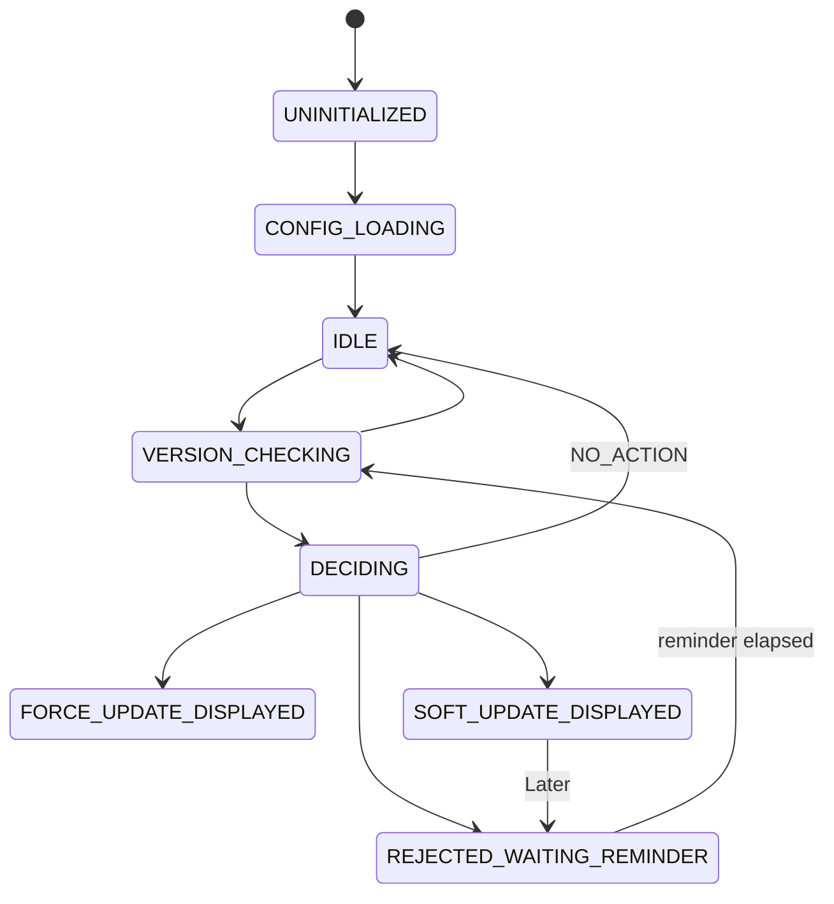

<div align="center">


[](https://www.npmjs.com/package/@rs-native-kit/version-check)
[](https://www.npmjs.com/package/@rs-native-kit/version-check)
[](https://github.com/rajssinde/rs-native-kit-version-check/actions/workflows/ci.yml)
[](./LICENSE)
[](#)
[](#requirements)

</div>

---

### Contents

[Why this exists](#why-this-exists) · [At a glance](#at-a-glance) · [Features](#features) · [Requirements](#requirements) · [Installation](#installation) · [Quick start](#quick-start) · [Configuration](#configuration-reference) · [Lifecycle](#lifecycle) · [Example app](#example-app) · [Contributing](#contributing)

---

## Why this exists

Shipping an update means nothing if half your users are stuck on a version from three releases ago. **`version-check`** answers three questions for you on every app launch:

1. **Is the user out of date?** — compares the running app version against what your store (or your own API) says is current.
2. **How out of date, and does it matter?** — runs that comparison through a policy engine (hard floor, reminder cadence, staged rollout %) to decide what actually needs to happen.
3. **What should the UI do about it?** — hands back a typed `ActionPlan` (`FORCE_UPDATE`, `SOFT_UPDATE`, `OPTIONAL_REMINDER`, `NO_ACTION`) that you render with the included components, your own UI, or ignore entirely if you just want the raw decision.

## At a glance

| | |
|---|---|
| 📦 Runtime dependencies | **1** — `react-native-nitro-modules` (the JSI binding layer) |
| 🏬 Store providers | Apple App Store, Google Play, Custom API (Huawei/Amazon/Firebase planned) |
| ⏱️ Default check cache | 6h TTL, persisted across app restarts |
| 🔁 Default reminder cadence | Every 3 days after "Later" |
| 🎯 Staged rollout | 0–100% device-bucketed rollout out of the box |
| 🧩 Setup | One `configure()` call, or `<VersionManagerProvider>` + a hook |
| 🖼️ Prebuilt UI | 3 ready-made components, or go fully headless |
| 🧪 Test coverage | Domain/config logic covered by unit tests, no device required |
| 🌐 Platforms | iOS, Android, Web (`react-native-web`) |

## Features

- 🏬 **Multi-store version lookup** — App Store, Google Play, or your own Custom API out of the box.
- 🧠 **Policy engine** — SemVer-aware force-update floor, reminder throttling, and percentage-based staged rollout.
- 🔐 **Signed remote config** — optionally hot-load update policy from a URL or bundled JSON, verified with Ed25519/HMAC via native OS crypto (never hand-rolled in JS).
- ⚛️ **React hooks + prebuilt UI** — `useVersionManager`, `<ForceUpdateScreen />`, `<SoftUpdateDialog />`, `<OptionalUpdateBanner />` — or go headless and build your own.
- 📡 **Event-driven** — subscribe to `stateChanged`, `updateDetected`, `userAction`, and `error` instead of polling.
- 🌐 **Web-ready** — the same JS API runs under `react-native-web`; no separate SDK.
- 🪶 **One runtime dependency** — `react-native-nitro-modules` (the JSI binding layer); the entire JS surface above it is hand-written, nothing else pulled in at install time.
- 🧪 **Fully unit-tested domain core** — SemVer engine, policy engine, lifecycle state machine, and config pipeline all run against mocks, no native layer required.

## Screenshots

The three prebuilt components from `@rs-native-kit/version-check/ui`, run on-device (iOS simulator):

| `<ForceUpdateScreen />` | `<SoftUpdateDialog />` | `<OptionalUpdateBanner />` |
|---|---|---|
|  |  |  |
| Full-screen, non-dismissible lockout | Dismissible bottom-sheet dialog | Low-intrusion floating banner |

## Requirements

> ⚠️ Ships as a **Nitro Module** (`HybridObject`) with no legacy-bridge fallback — the New Architecture (Fabric/TurboModules/JSI) must be enabled.

|  | Requirement | Minimum | Tested against |
|:---:|---|---|---|
| ⚛️ | React Native | **0.74+** · New Architecture enabled | `0.85.0` |
| ⚛️ | React | **18+** | `19.2.3` |
| 🍎 | iOS | **15.1+** | Xcode `16.1+` |
| 🤖 | Android | **API 24** (7.0)+ | compileSdk 36 · Kotlin 2.0.21 · JDK 17 |
| 🟢 | Node.js | **20+** | `24.13.0` (see `.nvmrc`) |
| 🔷 | TypeScript | 5+ · optional, full `.d.ts` shipped | `6.0.3` |

<br/>

|  | Platform | Support |
|:---:|---|---|
| 🍎 | **iOS** | ✅ Native Nitro Module — Ed25519 signature verification (`ios/HybridVersionCheck.swift`) |
| 🤖 | **Android** | ✅ Native Nitro Module — Kotlin, WorkManager-backed background scheduling |
| 🌐 | **Web** | ✅ Same JS API via `react-native-web` — browser `fetch` / `localStorage` bridge |

## Installation

```sh
npm install @rs-native-kit/version-check
# or
yarn add @rs-native-kit/version-check
```

**iOS** — install pods after adding the package:

```sh
cd ios && pod install
```

**Android** — no extra steps; the Nitro Module autolinks via `react-native.config.js`.

## Quick start

### Core API (framework-agnostic, zero React code pulled in)

```ts
import { VersionManager } from '@rs-native-kit/version-check';

const manager = VersionManager.configure({
  stores: {
    ios: { appStoreId: '123456789' },   // optional — omit to fall back to this app's bundle id
    android: { packageName: 'com.example.app' }, // optional — omit to use this app's own package name
  },
});

await manager.ready(); // waits for config resolution to settle
const plan = await manager.checkForUpdates();

switch (plan.type) {
  case 'FORCE_UPDATE':
    // block the app, show ForceUpdateScreen
    break;
  case 'SOFT_UPDATE':
    // dismissible prompt, show SoftUpdateDialog
    break;
  case 'OPTIONAL_REMINDER':
    // low-intrusion nudge, show OptionalUpdateBanner
    break;
  case 'NO_ACTION':
    // already current
    break;
}
```

### React hooks + prebuilt UI (separate, tree-shakeable entry point)

```tsx
import {
  useVersionManager,
  ForceUpdateScreen,
  SoftUpdateDialog,
  OptionalUpdateBanner,
} from '@rs-native-kit/version-check/ui';
import { Linking } from 'react-native';

function App() {
  const { state, isUpdateAvailable, updateInfo, checkForUpdates } =
    useVersionManager({
      stores: {
        ios: { appStoreId: '123456789' },
        android: { packageName: 'com.example.app' },
      },
      policy: {
        forceUpdateBelow: '2.0.0',
        reminderIntervalMs: 3 * 24 * 60 * 60 * 1000, // 3 days
      },
    });

  if (updateInfo?.isForceUpdate) {
    return (
      <ForceUpdateScreen
        updateInfo={updateInfo}
        onUpdatePress={() => Linking.openURL(updateInfo.storeUrl)}
      />
    );
  }

  return (
    <>
      {/* your app */}
      {isUpdateAvailable && updateInfo && (
        <SoftUpdateDialog
          updateInfo={updateInfo}
          onUpdatePress={() => Linking.openURL(updateInfo.storeUrl)}
          onLaterPress={() => {}}
        />
      )}
    </>
  );
}
```

### Events

```ts
manager.onUpdateDetected(({ updateInfo, actionPlan }) => { /* ... */ });
manager.onUserAction(({ action, updateInfo }) => { /* 'update_clicked' | 'later_clicked' | ... */ });
manager.onStateChanged(({ from, to }) => { /* lifecycle transitions */ });
manager.onError(({ error, phase }) => { /* 'config' | 'check' | 'policy' | 'presentation' */ });
```

## Configuration reference

Every field below is optional except `stores`, which needs at least one provider configured.

`stores.ios.appStoreId` and `stores.android.packageName` are themselves optional — pass them when you have them (App Store lookups by numeric id are the most reliable), and omit them to fall back automatically to the running app's own bundle id (`IAppInfoProvider.getBundleId()`, resolved at check time) — which *is* the package name on Android, and a supported alternate lookup key (`bundleId=`) against the iTunes Lookup API on iOS:

```ts
VersionManager.configure({
  stores: {
    ios: { region: 'us' },   // appStoreId omitted -> looked up by this app's bundle id
    android: {},             // packageName omitted -> uses this app's own package name
    custom: { url: 'https://api.example.com/version.json', headers: {} },
  },
  policy: {
    forceUpdateBelow: '2.0.0',       // SemVer floor — anything older is FORCE_UPDATE
    reminderIntervalMs: 259_200_000, // how often to re-nag after "Later" (default 3 days)
    rolloutPercentage: 100,          // staged rollout, 0-100
  },
  cache: {
    ttlMs: 21_600_000,               // how long a store lookup is cached (default 6h)
    storage: 'persistent',           // 'memory' | 'persistent'
    bustOnManualCheck: true,
  },
  fallback: {
    onNetworkError: 'useCache',      // 'useCache' | 'useDefaultConfig' | 'noAction'
    requestTimeoutMs: 8_000,
    retry: { maxAttempts: 3, backoff: 'exponential-jitter', baseDelayMs: 500 },
  },
  remoteConfigUrl: 'https://api.example.com/vm-config.json', // optional hot-reloadable config
  security: { signatureAlgorithm: 'ed25519', trustedKeyIds: ['prod-key-1'] },
  logging: { level: 'warn' },
});
```

### Store providers

| Provider | Status |
|---|---|
| Apple App Store | ✅ Implemented |
| Google Play | ✅ Implemented |
| Custom API | ✅ Implemented |
| Huawei AppGallery | 🚧 Planned — throws `UnsupportedStoreException` today |
| Amazon Appstore | 🚧 Planned — throws `UnsupportedStoreException` today |
| Firebase Remote Config | 🚧 Planned — throws `UnsupportedStoreException` today |

### Remote / signed configuration

On top of the options you hardcode at `configure()`, you can layer a **local bundled JSON** and/or a **remote URL**, both wrapped in a signed envelope (`schemaVersion`, `payload`, `signature`) and verified against `security.trustedKeyIds` before any field is trusted. Precedence is `env overrides > remote > local > configure() defaults`, merged field-by-field, with automatic fallback to the last known-good config if a remote fetch fails.

## Lifecycle



Read the current state any time with `manager.getCurrentState()`, or subscribe via `onStateChanged`.

## Example app

```sh
yarn
yarn example ios      # or `yarn example android`, `yarn example web`
```

## Contributing

- [Development workflow](CONTRIBUTING.md#development-workflow)
- [Sending a pull request](CONTRIBUTING.md#sending-a-pull-request)
- [Code of conduct](CODE_OF_CONDUCT.md)

## License

MIT © [Rajesh Shinde](https://github.com/rajssinde)

---

<div align="center">

If this saved you a support ticket, consider starring the repo ⭐

</div>

---
