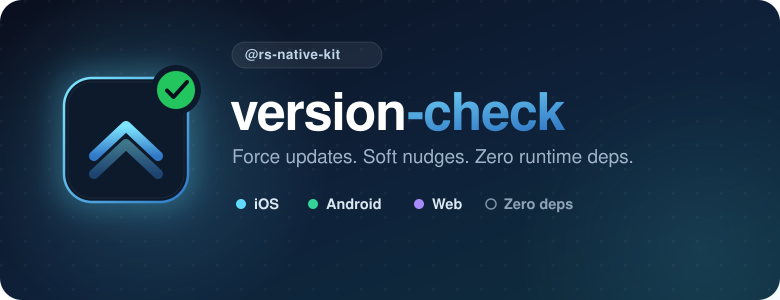
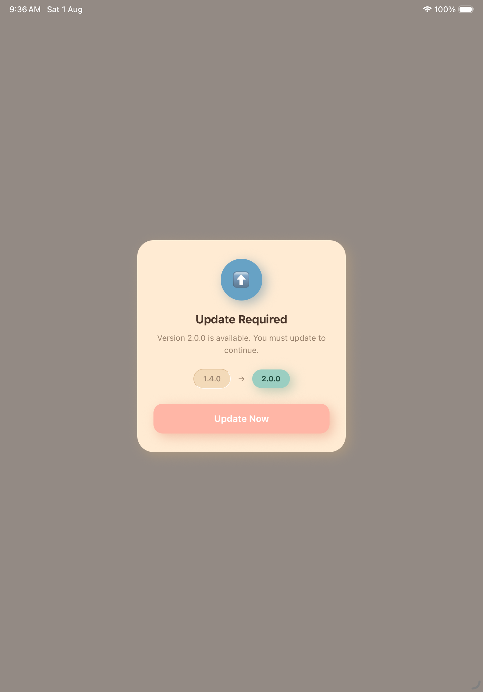
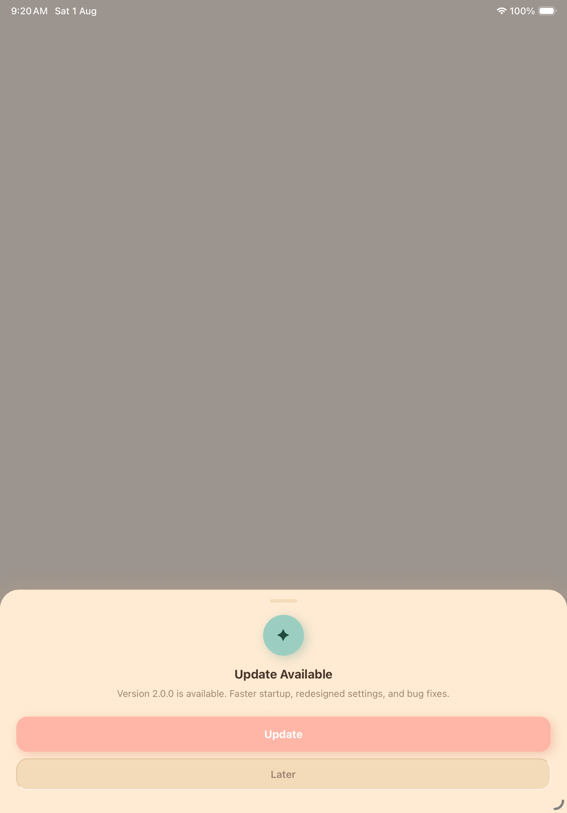
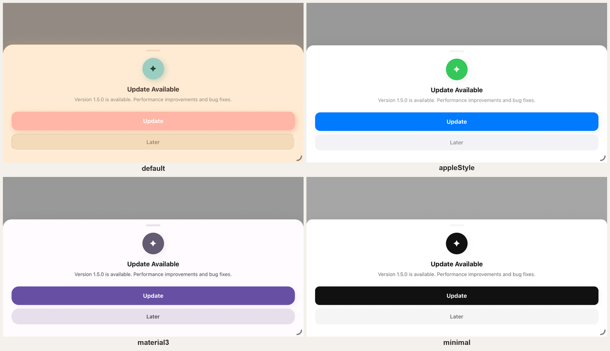
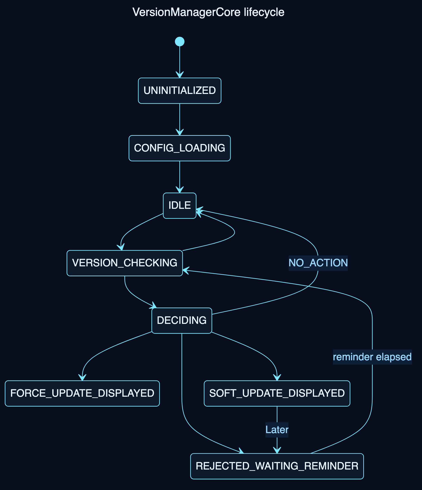

<div align="center">



# React Native Force Update & Soft Update Checker

**`@rs-native-kit/version-check`** is a React Native library that checks the App Store, Google Play, or a custom API for the latest app version and tells you whether to force update, soft update, or remind the user — with prebuilt UI, staged rollout, and a signed remote-config pipeline.

[](https://www.npmjs.com/package/@rs-native-kit/version-check)
[](https://www.npmjs.com/package/@rs-native-kit/version-check)
[](https://github.com/rajssinde/rs-native-kit-version-check/actions/workflows/ci.yml)
[](./LICENSE)
[](#)
[](#requirements)

</div>

---

### Contents

[Why this exists](#why-this-exists) · [At a glance](#at-a-glance) · [Features](#features) · [Requirements](#requirements) · [Installation](#installation) · [Quick start](#quick-start) · [Configuration](#configuration-reference) · [Lifecycle](#lifecycle) · [Example app](#example-app) · [Contributing](#contributing)

---

## Why this exists

Every React Native app eventually needs a **force update**, a **soft update**, or a way to **check the current app version** against what's live on the App Store or Google Play. Shipping a release means nothing if half your users are stuck on a version from three launches ago. **`version-check`** answers three questions for you on every app launch:

1. **Is the user out of date?** — compares the running app version against what your store (or your own API) says is current.
2. **How out of date, and does it matter?** — runs that comparison through a policy engine (hard floor, reminder cadence, staged rollout %) to decide what actually needs to happen.
3. **What should the UI do about it?** — hands back a typed `ActionPlan` (`FORCE_UPDATE`, `SOFT_UPDATE`, `OPTIONAL_REMINDER`, `NO_ACTION`) that you render with the included components, your own UI, or ignore entirely if you just want the raw decision.

## At a glance

| | |
|---|---|
| 📦 Runtime dependencies | **1** — `react-native-nitro-modules` (the JSI binding layer) |
| 🏬 Store providers | Apple App Store, Google Play, Custom API, Huawei AppGallery, Amazon Appstore, Firebase Remote Config |
| ⏱️ Default check cache | 6h TTL, persisted across app restarts |
| 🔁 Default reminder cadence | Every 3 days after "Later" |
| 🎯 Staged rollout | 0–100% device-bucketed rollout out of the box |
| 🧩 Setup | One `configure()` call, or `<VersionManagerProvider>` + a hook |
| 🖼️ Prebuilt UI | 3 ready-made components, or go fully headless |
| 🧪 Test coverage | Domain/config logic covered by unit tests, no device required |
| 🌐 Platforms | iOS, Android, Web (`react-native-web`) |

## Features

- 🏬 **Multi-store version lookup** — App Store, Google Play, or your own Custom API out of the box.
- 🧠 **Policy engine** — SemVer-aware force-update floor, reminder throttling, and percentage-based staged rollout.
- 🔐 **Signed remote config** — optionally hot-load update policy from a URL or bundled JSON, verified with Ed25519/HMAC via native OS crypto (never hand-rolled in JS).
- ⚛️ **React hooks + prebuilt UI** — `useVersionManager`, `<ForceUpdateScreen />`, `<SoftUpdateDialog />`, `<OptionalUpdateBanner />` — themeable (`default`/`appleStyle`/`material3`/`minimal`, light & dark) and localized out of the box in 12 languages, or go headless and build your own.
- 📡 **Event-driven** — subscribe to `stateChanged`, `updateDetected`, `userAction`, and `error` instead of polling.
- 🌐 **Web-ready** — the same JS API runs under `react-native-web`; no separate SDK.
- 🪶 **One runtime dependency** — `react-native-nitro-modules` (the JSI binding layer); the entire JS surface above it is hand-written, nothing else pulled in at install time.
- 🧪 **Fully unit-tested domain core** — SemVer engine, policy engine, lifecycle state machine, and config pipeline all run against mocks, no native layer required.

## Screenshots

The three prebuilt components from `@rs-native-kit/version-check/ui`, run on-device (iOS simulator):

| `<ForceUpdateScreen />` | `<SoftUpdateDialog />` | `<OptionalUpdateBanner />` |
|---|---|---|
|  |  |  |
| Full-screen, non-dismissible lockout | Dismissible bottom-sheet dialog | Low-intrusion floating banner |

Every component also takes a `theme` prop — `<SoftUpdateDialog />` shown here in all 4 (light mode, iOS simulator):

<div align="center">

</div>

## Requirements

> ⚠️ Ships as a **Nitro Module** (`HybridObject`) with no legacy-bridge fallback — the New Architecture (Fabric/TurboModules/JSI) must be enabled.

|  | Requirement | Minimum | Tested against |
|:---:|---|---|---|
| ⚛️ | React Native | **0.74+** · New Architecture enabled | `0.85.0` |
| ⚛️ | React | **18+** | `19.2.3` |
| 🍎 | iOS | **15.1+** | Xcode `16.1+` |
| 🤖 | Android | **API 24** (7.0)+ | compileSdk 36 · Kotlin 2.0.21 · JDK 17 |
| 🟢 | Node.js | **20+** | `24.13.0` (see `.nvmrc`) |
| 🔷 | TypeScript | 5+ · optional, full `.d.ts` shipped | `6.0.3` |

<br/>

|  | Platform | Support |
|:---:|---|---|
| 🍎 | **iOS** | ✅ Native Nitro Module — Ed25519 signature verification (`ios/HybridVersionCheck.swift`) |
| 🤖 | **Android** | ✅ Native Nitro Module — Kotlin, WorkManager-backed background scheduling |
| 🌐 | **Web** | ✅ Same JS API via `react-native-web` — browser `fetch` / `localStorage` bridge |

## Installation

```sh
npm install @rs-native-kit/version-check
# or
yarn add @rs-native-kit/version-check
```

**iOS** — install pods after adding the package:

```sh
cd ios && pod install
```

**Android** — no extra steps; the Nitro Module autolinks via `react-native.config.js`.

## Quick start

### Core API (framework-agnostic, zero React code pulled in)

```ts
import { VersionManager } from '@rs-native-kit/version-check';

const manager = VersionManager.configure({
  stores: {
    ios: { appStoreId: '123456789' },   // optional — omit to fall back to this app's bundle id
    android: { packageName: 'com.example.app' }, // optional — omit to use this app's own package name
  },
});

await manager.ready(); // waits for config resolution to settle
const plan = await manager.checkForUpdates();

switch (plan.type) {
  case 'FORCE_UPDATE':
    // block the app, show ForceUpdateScreen
    break;
  case 'SOFT_UPDATE':
    // dismissible prompt, show SoftUpdateDialog
    break;
  case 'OPTIONAL_REMINDER':
    // low-intrusion nudge, show OptionalUpdateBanner
    break;
  case 'NO_ACTION':
    // already current
    break;
}
```

### React hooks + prebuilt UI (separate, tree-shakeable entry point)

```tsx
import {
  useVersionManager,
  ForceUpdateScreen,
  SoftUpdateDialog,
  OptionalUpdateBanner,
} from '@rs-native-kit/version-check/ui';
import { Linking } from 'react-native';

function App() {
  const { state, isUpdateAvailable, updateInfo, checkForUpdates } =
    useVersionManager({
      stores: {
        ios: { appStoreId: '123456789' },
        android: { packageName: 'com.example.app' },
      },
      policy: {
        forceUpdateBelow: '2.0.0',
        reminderIntervalMs: 3 * 24 * 60 * 60 * 1000, // 3 days
      },
    });

  if (updateInfo?.isForceUpdate) {
    return (
      <ForceUpdateScreen
        updateInfo={updateInfo}
        onUpdatePress={() => Linking.openURL(updateInfo.storeUrl)}
      />
    );
  }

  return (
    <>
      {/* your app */}
      {isUpdateAvailable && updateInfo && (
        <SoftUpdateDialog
          updateInfo={updateInfo}
          onUpdatePress={() => Linking.openURL(updateInfo.storeUrl)}
          onLaterPress={() => {}}
        />
      )}
    </>
  );
}
```

Each prebuilt component takes an optional `theme` prop — `'default' | 'appleStyle' | 'material3' | 'minimal'` — resolved against the OS color scheme automatically (light/dark), no extra config:

```tsx
<ForceUpdateScreen updateInfo={updateInfo} onUpdatePress={...} theme="material3" />
```

Omitting `theme` keeps the original look (`'default'`) exactly as before — this is purely additive.

Default copy (title/message/button labels) is localized out of the box — resolved from the device locale (`Intl.DateTimeFormat().resolvedOptions().locale`, no native call needed), covering `en`, `es`, `fr`, `de`, `it`, `pt`, `ja`, `zh`, `ko`, `hi`, `ar`, `ru`, falling back to English for anything else. Pass `locale` to override auto-detection, or any of `title`/`message`/`updateButtonLabel`/`laterButtonLabel` to override specific copy regardless of locale — both work exactly as before localization existed:

```tsx
<SoftUpdateDialog updateInfo={updateInfo} onUpdatePress={...} onLaterPress={...} locale="fr" />
```

This library doesn't flip layout direction for RTL languages (Arabic) — only the text itself is translated.

Each component also takes an optional `onOtaUpdateAvailable`, called instead of `onUpdatePress` when `updateInfo.recommendedChannel === 'ota'` (see [Custom API](#custom-api) above) — wire it to your own OTA client:

```tsx
<SoftUpdateDialog
  updateInfo={updateInfo}
  onUpdatePress={() => Linking.openURL(updateInfo.storeUrl)}
  onOtaUpdateAvailable={() => Updates.reloadAsync()} // expo-updates, or CodePush.sync()
  onLaterPress={() => {}}
/>
```

### Events

```ts
manager.onUpdateDetected(({ updateInfo, actionPlan }) => { /* ... */ });
manager.onUserAction(({ action, updateInfo }) => { /* 'update_clicked' | 'later_clicked' | ... */ });
manager.onStateChanged(({ from, to }) => { /* lifecycle transitions */ });
manager.onError(({ error, phase }) => { /* 'config' | 'check' | 'policy' | 'presentation' */ });
```

### Analytics (separate, tree-shakeable entry point)

`@rs-native-kit/version-check/analytics` is a thin fan-out helper over the events above — it never imports an analytics SDK itself, it just forwards every event to a sink function you write against your own already-instantiated client:

```ts
import { subscribeAnalytics, AnalyticsAdapter } from '@rs-native-kit/version-check/analytics';

subscribeAnalytics(manager, AnalyticsAdapter.combine(
  (event, payload) => mixpanelInstance.track(event, payload),
  (event, payload) => analytics().logEvent(event, payload), // @react-native-firebase/analytics
  (event, payload) => console.log(`[VersionCheck] ${event}`, payload),
));
```

## Configuration reference

Every field below is optional except `stores`, which needs at least one provider configured.

`stores.ios.appStoreId` and `stores.android.packageName` are themselves optional — pass them when you have them (App Store lookups by numeric id are the most reliable), and omit them to fall back automatically to the running app's own bundle id (`IAppInfoProvider.getBundleId()`, resolved at check time) — which *is* the package name on Android, and a supported alternate lookup key (`bundleId=`) against the iTunes Lookup API on iOS:

```ts
VersionManager.configure({
  stores: {
    ios: { region: 'us' },   // appStoreId omitted -> looked up by this app's bundle id
    android: {},             // packageName omitted -> uses this app's own package name
    custom: { url: 'https://api.example.com/version.json', headers: {} },
  },
  policy: {
    forceUpdateBelow: '2.0.0',       // SemVer floor — anything older is FORCE_UPDATE
    reminderIntervalMs: 259_200_000, // how often to re-nag after "Later" (default 3 days)
    rolloutPercentage: 100,          // staged rollout, 0-100
    channel: 'prod',                 // your own build channel/flavor — this library never infers it
    rules: [                         // first-match-wins, layered over the fields above
      { minOsVersion: '17.0', forceUpdateBelow: '3.0.0' },
      { channel: 'beta', forceUpdateBelow: '3.1.0-beta.2' },
    ],
  },
  cache: {
    ttlMs: 21_600_000,               // how long a store lookup is cached (default 6h)
    storage: 'persistent',           // 'memory' | 'persistent'
    bustOnManualCheck: true,
  },
  fallback: {
    onNetworkError: 'useCache',      // 'useCache' | 'useDefaultConfig' | 'noAction'
    requestTimeoutMs: 8_000,
    retry: { maxAttempts: 3, backoff: 'exponential-jitter', baseDelayMs: 500 },
  },
  remoteConfigUrl: 'https://api.example.com/vm-config.json', // optional hot-reloadable config
  security: { signatureAlgorithm: 'ed25519', trustedKeyIds: ['prod-key-1'] },
  logging: { level: 'warn' },
});
```

`policy.rules` are evaluated in order and the first fully-matching rule wins — a rule with no `channel` matches any channel, a rule with no `minOsVersion` matches any OS version, and `minOsVersion` matches when the device's OS version is at or above it. No matching rule (or no `rules` at all) falls back to the top-level `forceUpdateBelow`/`rolloutPercentage`. `channel` is entirely your own concept (e.g. a build flavor or `expo-updates` release channel) — pass whatever string you want; this library never infers it.

`rules`/`channel` are `configure()`-time only for now, not yet part of the signed remote-config document schema below.

If a signed remote config fetch fails (network error, invalid signature, malformed document), the SDK automatically falls back to the last successfully-verified remote config rather than reverting to your `configure()` defaults — so a transient outage or a bad publish doesn't regress live devices back to weaker settings. Publishing a corrected/rolled-back document normally is all that's needed to recover; there's no separate "recall" step.

### Store providers

| Provider | Status |
|---|---|
| Apple App Store | ✅ Implemented |
| Google Play | ✅ Implemented |
| Custom API | ✅ Implemented |
| Huawei AppGallery | ✅ Implemented — requires a consumer-supplied AGC access token, see below |
| Amazon Appstore | ✅ Implemented — best-effort HTML scrape, no official Amazon API, see below |
| Firebase Remote Config | ✅ Implemented — REST-only, no Firebase SDK dependency, see below |

Multiple providers can be registered at once — `VersionRepositoryImpl` tries them in registration order (platform store → Huawei → Amazon → Firebase Remote Config → Custom) and uses the first one that succeeds, so e.g. a Huawei device without Google Play can fall through past a failed/unregistered Google Play lookup to Huawei/Amazon/Custom.

#### Custom API

Your endpoint's JSON response can optionally assert `"updateChannel": "ota" | "binary"` alongside the required `latestVersion`/`storeUrl` fields:

```json
{ "latestVersion": "2.1.0", "storeUrl": "https://example.com/app", "updateChannel": "ota" }
```

This surfaces as `updateInfo.recommendedChannel` (`'ota' | 'binary'`, defaults to `'binary'` when omitted — today's behavior, unchanged). It's a pure signal: this library never verifies it and never imports an OTA client itself — pair it with `onOtaUpdateAvailable` on the prebuilt UI components (see below) to route to your own `Updates.reloadAsync()`/`CodePush.sync()` instead of a store redirect when a release doesn't need a new binary.

#### Huawei AppGallery

Huawei's public AppGallery listing page is a client-rendered SPA with no version data in the raw HTTP response, so this provider calls Huawei's AGC "App Info Query" Open API instead. This library never performs Huawei's OAuth client_id/secret exchange itself — your own backend does that and hands the client a bearer token:

```ts
stores: {
  huawei: {
    appId: '102717837',
    // either a short-lived static token...
    accessToken: myToken,
    // ...or a callback for tokens that expire (preferred):
    getAccessToken: () => fetchHuaweiTokenFromMyBackend(),
    clientId: 'my-agc-client-id', // optional
  },
},
```

Without one of `accessToken`/`getAccessToken`, the Huawei provider is not registered at all (silently, same as any other unconfigured store). Only registered on Android.

#### Amazon Appstore

```ts
stores: {
  amazon: { asin: 'B0731LX7VR' },
},
```

Amazon has no official version-lookup API, and its public listing page does not reliably expose a parseable version field — this is a best-effort HTML scrape, weaker than Google Play's own scrape. A parse failure throws `StoreResponseParseException`, which the sequential-fallback repository already handles by moving on to the next registered provider. If you need reliability, prefer `custom` pointed at your own endpoint. Only registered on Android.

#### Firebase Remote Config

```ts
stores: {
  firebaseRemoteConfig: {
    apiKey: 'AIzaSy...',
    projectId: '1234567890',       // Firebase project number
    appId: '1:1234567890:android:abcdef123456',
    parameterKey: 'latest_version',            // default
    storeUrlParameterKey: 'update_store_url',  // optional
    releaseNotesParameterKey: 'release_notes', // optional
    minimumOsVersionParameterKey: 'min_os_version', // optional
  },
},
```

Fetches Remote Config parameter values over plain REST (Firebase Installations API + Remote Config `:fetch`) — the same calls the native SDK makes internally, with no Firebase SDK/native setup required. This is a reverse-engineered, unofficial contract rather than a documented public API, so treat it with the same "may change without notice" caution as the Google Play/Amazon scrapes. Registered regardless of platform.

### Remote / signed configuration

On top of the options you hardcode at `configure()`, you can layer a **local bundled JSON** and/or a **remote URL**, both wrapped in a signed envelope (`schemaVersion`, `payload`, `signature`) and verified against `security.trustedKeyIds` before any field is trusted. Precedence is `env overrides > remote > local > configure() defaults`, merged field-by-field, with automatic fallback to the last known-good config if a remote fetch fails.

#### Verifying a config document before you deploy it

```sh
npx @rs-native-kit/version-check verify --config ./vm-config.json
npx @rs-native-kit/version-check verify --config ./vm-config.json --public-key <base64-ed25519-public-key>
npx @rs-native-kit/version-check verify --config ./vm-config.json --hmac-secret <shared-secret>
```

Checks envelope size, schema shape, and field-level boundaries (SemVer fields, HTTPS URLs, store id shapes — the same checks the app itself runs) against a signed config document, without needing a device or simulator. Signature verification is optional and requires the actual key material as a flag — this CLI has no access to the key your compiled app resolves natively from a `keyId` (doc 03 §3.4), so without `--public-key`/`--hmac-secret` it validates shape only and says so explicitly. Exits non-zero on any failure, so it's CI-friendly (`... && echo ok || exit 1`).

## Lifecycle

<div align="center">

</div>

Read the current state any time with `manager.getCurrentState()`, or subscribe via `onStateChanged`. Source: [`src/domain/statemachine/LifecycleStateMachine.ts`](src/domain/statemachine/LifecycleStateMachine.ts).

## Example app

```sh
yarn
yarn example ios      # or `yarn example android`, `yarn example web`
```

## Contributing

- [Development workflow](CONTRIBUTING.md#development-workflow)
- [Sending a pull request](CONTRIBUTING.md#sending-a-pull-request)
- [Code of conduct](CODE_OF_CONDUCT.md)

## License

MIT © [Rajesh Shinde](https://github.com/rajssinde)

---

<div align="center">

If this saved you a support ticket, consider starring the repo ⭐

</div>

---
