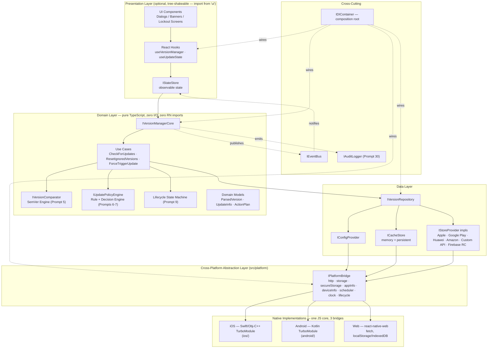
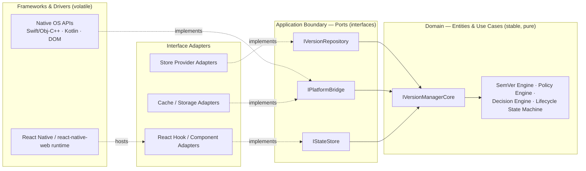
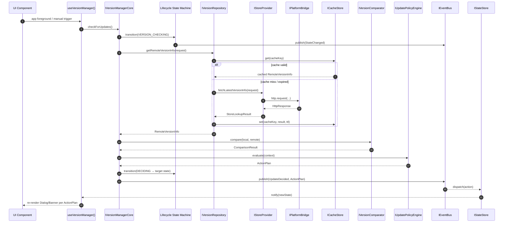
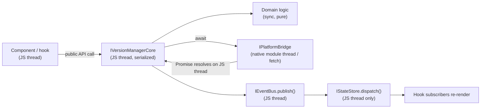

# Version Manager — Enterprise Architecture & Folder Structure

**Design Document Series:** Phase 1 — Foundation · Prompt 1/40
**Scope:** `@rs-native-kit/version-check` — a single React Native library (New Architecture / TurboModules) that targets iOS, Android, and Web (via `react-native-web`).
**Status:** Architecture specification only. No implementation code is included or implied by this document.

---

## 0. Purpose & Positioning

This document defines the enterprise architecture for **Version Manager**, distributed as one npm package:

| Package | `@rs-native-kit/version-check` |
|---|---|
| Distribution | npm, single repo (this repository) |
| Runtime | React Native 0.74+, New Architecture (TurboModules) |
| Native targets | iOS (Swift/Obj-C++), Android (Kotlin), Web (`react-native-web` + Vite, per the existing `example/vite.config.mjs`) |
| Consumers | RN apps importing `@rs-native-kit/version-check`; the same JS/TS bundle also runs under `react-native-web` for the Web target — there is no separate Web SDK |

This is **one library**, not a multi-SDK family. "Cross-platform" here means: one TypeScript domain/business-logic core, with three thin native adapters (iOS, Android, Web) behind a single abstraction interface — exactly the shape `react-native-builder-bob` already scaffolds in this repo (`src/`, `ios/`, `android/`, `example/` with `vite.config.mjs` for the web build).

---

## 1. Architectural Philosophy

### 1.1 Clean Architecture as the governing discipline

The library is structured as four concentric layers inside `src/`, dependencies pointing strictly inward:

```
Presentation  →  Domain  ←  Data
                    ↑
              Platform Bridge
```

- **Domain** is the only layer with no outward dependency on anything — no I/O, no `react-native` imports, no UI. It is pure TypeScript: value objects, use cases, the SemVer engine, the policy/rule engine, the lifecycle state machine.
- **Data** and **Platform Bridge** are *interface adapters*: they exist to implement the ports (interfaces) Domain declares. Domain never imports them.
- **Presentation** (React components/hooks) depends only on Domain's models/ports and the composition root — never directly on Data or the native bridge.

### 1.2 The Dependency Rule

> Source code dependencies must point only inward. Nothing in an inner circle can know anything about an outer circle.

Enforced via folder boundaries plus lint rules (§11), not just convention — this is what keeps `domain/` testable with zero mocking of React Native itself.

### 1.3 Ports & Adapters (Hexagonal framing)

Domain declares **ports** — `IVersionRepository`, `IPlatformBridge`, `IClock`, etc. Everything outside Domain is an **adapter** implementing a port. `src/di/container.ts` is the only file that knows about both a port and its concrete adapter simultaneously — this is what lets a store provider, cache backend, or the entire UI layer be omitted from a given app's bundle without touching Domain.

### 1.4 Why iOS/Android/Web share one JS core here (and Flutter/native-Swift/native-Kotlin do not exist in this scope)

Because this is a single React Native package, iOS and Android are reached through **TurboModule native bridges** (this repo already has `ios/VersionCheck.mm` and `android/...`), and Web is reached by the *same* JS bundle running under `react-native-web`, with a browser-native `IPlatformBridge` implementation swapped in instead of the TurboModule one. All business logic (SemVer parsing, policy evaluation, state machine, caching decisions) lives once, in `src/domain` and `src/data`, and never needs to be re-implemented per platform — only `IPlatformBridge` has three implementations.

### 1.5 Data flow patterns

- **Command flow** (write/trigger): `UI event → Hook → Use Case (Domain) → Repository port → Provider/Bridge adapter`. Async at the boundary, synchronous/pure inside Domain.
- **Query flow** (read): `Component → useUpdateState()/IStateStore.getState()` — synchronous, non-blocking, served from last computed state, never triggers I/O.
- **Event flow** (reactive propagation): `Bridge/Repository → Domain → IEventBus.publish() → IStateStore.dispatch() → subscribed component re-render` — full sequence in §6.

---

## 2. Architectural Component Diagram



---

## 3. Layering Model & the Dependency Rule (concentric view)



**Reading the diagram:** an arrow means "depends on / imports." Outer rings implement inner-ring interfaces; the inner ring never references a concrete outer-ring type — only the port. `IVersionManagerCore` is the sole class Domain exposes outward.

### Layer responsibility matrix

| Layer | Owns | Must NOT contain | May depend on |
|---|---|---|---|
| Domain | Models, ports, use cases, SemVer/Policy/Decision engines, state machine | I/O, timers tied to a real clock, `react-native` imports, UI imports | Nothing outside Domain |
| Data | Repository implementation, store providers, cache adapters, config loader/validator | UI rendering, concrete platform-bridge instantiation (injected, not imported) | `domain/models`, `domain/ports` |
| Platform Bridge | Concrete `IPlatformBridge` for iOS TurboModule, Android TurboModule, and Web (RNW) | Business/comparison/policy logic | `domain/ports` only |
| Presentation | State store, UI components, hooks, theming | Network calls, cache/storage access, store-provider logic | `domain/models`, `domain/ports`, `IStateStore` |
| DI (composition root) | Wiring of concrete adapters to ports, singleton/transient lifecycle | Business logic | Everything (only layer allowed to) |

---

## 4. Cross-Platform Abstraction Layer

`IPlatformBridge` is the single seam that decouples Domain/Data from iOS, Android, and Web. Nothing above this layer knows which of the three it's running on.

```typescript
// src/domain/ports/IPlatformBridge.ts — canonical contract

interface IPlatformBridge {
  readonly platform: PlatformId;   // 'ios' | 'android' | 'web'
  readonly http: IHttpClient;
  readonly storage: IKeyValueStorage;
  readonly secureStorage: ISecureStorage;
  readonly appInfo: IAppInfoProvider;
  readonly deviceInfo: IDeviceInfoProvider;
  readonly scheduler: IBackgroundScheduler;
  readonly clock: IClock;
  readonly lifecycle: IAppLifecycleObserver;
}

interface IHttpClient {
  request(req: HttpRequest): Promise<HttpResponse>;
}

interface IKeyValueStorage {
  get(key: string): Promise<string | null>;
  set(key: string, value: string): Promise<void>;
  remove(key: string): Promise<void>;
}

interface ISecureStorage {
  getItem(key: string): Promise<string | null>;
  setItem(key: string, value: string): Promise<void>;
  removeItem(key: string): Promise<void>;
}

interface IAppInfoProvider {
  getCurrentVersion(): string;
  getBuildNumber(): string;
  getBundleId(): string;
}

interface IDeviceInfoProvider {
  getOsVersion(): string;
  getDeviceModel(): string;
  getLocale(): string;
}

interface IBackgroundScheduler {
  schedule(task: BackgroundTaskDescriptor): Promise<void>;
  cancel(taskId: string): Promise<void>;
}

interface IAppLifecycleObserver {
  onForeground(cb: () => void): Unsubscribe;
  onBackground(cb: () => void): Unsubscribe;
}

interface IClock {
  now(): number;   // epoch ms — overridable for tamper detection (Prompt 32) and deterministic tests
}
```

### 4.1 Per-target realization

| Sub-port | iOS (native module) | Android (native module) | Web (`react-native-web`) |
|---|---|---|---|
| `http` | `URLSession` via TurboModule | `HttpURLConnection` via TurboModule (no OkHttp — zero-dep) | `fetch` |
| `storage` | `UserDefaults` via TurboModule | `SharedPreferences` via TurboModule | `localStorage` |
| `secureStorage` | `Keychain` via TurboModule | `EncryptedSharedPreferences`/`Keystore` via TurboModule | `IndexedDB`, encrypted at rest via SubtleCrypto |
| `appInfo`/`deviceInfo` | `Bundle`/`UIDevice` via TurboModule | `PackageManager`/`Build` via TurboModule | `navigator`, build-time injected version |
| `scheduler` | `BGTaskScheduler` via TurboModule | `WorkManager` via TurboModule | Service Worker `periodicSync` (feature-detected) / visibility-change fallback |
| `lifecycle` | `UIApplication` delegate notifications, surfaced through RN `AppState` | `ProcessLifecycleOwner`, surfaced through RN `AppState` | `visibilitychange`/`focus`/`blur` |
| `clock` | `Date()` wrapped | `System.currentTimeMillis()` wrapped | `Date.now()` wrapped |

Each row is one `IPlatformBridge` implementation file under `src/platform/native/` (RN TurboModule-backed, covers iOS+Android through one JS wrapper calling into `NativeVersionCheck`) and one under `src/platform/web/` (pure browser APIs, no native module, activated when `Platform.OS === 'web'` — the same detection `react-native-web` already relies on).

---

## 5. Directory Structure Specification

```
version-check/                                          # @rs-native-kit/version-check (this repository)
├── src/
│   ├── index.tsx                                          # public-api barrel — tree-shake root, core only
│   ├── ui.tsx                                               # separate public entry — presentation layer only
│   ├── domain/
│   │   ├── models/
│   │   │   ├── ParsedVersion.ts
│   │   │   ├── UpdateInfo.ts
│   │   │   ├── ActionPlan.ts
│   │   │   └── LifecycleState.ts
│   │   ├── ports/
│   │   │   ├── IVersionRepository.ts
│   │   │   ├── IPlatformBridge.ts
│   │   │   ├── IStoreProvider.ts
│   │   │   ├── ICacheStore.ts
│   │   │   ├── IConfigProvider.ts
│   │   │   └── IClock.ts
│   │   ├── usecases/
│   │   │   ├── CheckForUpdatesUseCase.ts
│   │   │   ├── ResetIgnoredVersionsUseCase.ts
│   │   │   └── ForceTriggerUpdateUseCase.ts
│   │   ├── engines/
│   │   │   ├── semver/                                        # Prompt 5 — zero-dependency SemVer engine
│   │   │   ├── policy/                                          # Prompt 6 — Rule Engine
│   │   │   └── decision/                                          # Prompt 7 — Decision Engine
│   │   └── statemachine/
│   │       └── LifecycleStateMachine.ts                             # Prompt 9
│   ├── data/
│   │   ├── repositories/
│   │   │   └── VersionRepositoryImpl.ts
│   │   ├── providers/                                         # one folder per store, independently tree-shakeable
│   │   │   ├── apple/AppleStoreProvider.ts
│   │   │   ├── google-play/GooglePlayProvider.ts
│   │   │   ├── huawei/HuaweiAppGalleryProvider.ts
│   │   │   ├── amazon/AmazonAppstoreProvider.ts
│   │   │   ├── custom-api/CustomApiProvider.ts
│   │   │   └── firebase-remote-config/FirebaseRemoteConfigProvider.ts
│   │   ├── cache/
│   │   │   ├── MemoryCacheStore.ts
│   │   │   └── PersistentCacheStore.ts
│   │   ├── config/
│   │   │   ├── ConfigLoader.ts
│   │   │   └── ConfigValidator.ts
│   │   └── mappers/
│   ├── platform/                                            # Cross-Platform Abstraction Layer
│   │   ├── contracts/
│   │   │   └── IPlatformBridge.ts                              # re-export from domain/ports
│   │   ├── native/                                              # iOS + Android — TurboModule-backed
│   │   │   ├── NativeVersionCheck.ts                              # TurboModule Codegen spec (existing file)
│   │   │   └── NativePlatformBridge.ts                              # implements IPlatformBridge via TurboModule
│   │   └── web/                                                  # Web — react-native-web target
│   │       └── WebPlatformBridge.ts                                # implements IPlatformBridge via fetch/localStorage/IndexedDB
│   ├── presentation/                                           # imported only via 'src/ui.tsx' — tree-shakeable
│   │   ├── state/
│   │   │   └── VersionManagerStore.ts
│   │   ├── components/
│   │   │   ├── ForceUpdateScreen.tsx
│   │   │   ├── SoftUpdateDialog.tsx
│   │   │   └── OptionalUpdateBanner.tsx
│   │   ├── hooks/
│   │   │   ├── useVersionManager.ts
│   │   │   └── useUpdateState.ts
│   │   └── theme/
│   ├── di/
│   │   └── container.ts                                        # composition root
│   ├── shared/                                                 # cross-cutting, in-house, zero external deps
│   │   ├── eventbus/EventBus.ts
│   │   └── logging/Logger.ts
│   └── __tests__/
│       ├── domain/
│       ├── data/
│       └── mocks/
│           ├── MockPlatformBridge.ts
│           ├── MockStoreProvider.ts
│           └── MockClock.ts
├── ios/                                                      # Cross-Platform Abstraction Layer — native (Swift/Obj-C++)
│   ├── VersionCheck.h / VersionCheck.mm                        # existing TurboModule glue
│   └── PlatformBridge/IOSPlatformBridge.swift                    # implements native side of IPlatformBridge
├── android/src/main/java/com/rsnativekit/versioncheck/
│   ├── VersionCheckModule.kt / VersionCheckPackage.kt
│   └── platformbridge/AndroidPlatformBridge.kt
├── example/                                                  # existing harness app — RN (iOS/Android) + Web via vite.config.mjs
└── docs/architecture/                                        # this document series
```

**Note on Web:** there is no separate `packages/web` — Web is a build target of this same package, reached by `react-native-web` aliasing `react-native` imports and Metro/Vite resolving `*.web.ts`/`Platform.select` branches, exactly as `src/multiply.native.tsx` already demonstrates the platform-file-extension pattern in this repo. `WebPlatformBridge.ts` is selected the same way.

---

## 6. Event-Driven & Reactive Flow

All cross-layer propagation goes through ports and the event bus — never through direct mutation of another layer's state.



**Contract used at every hop:**

```typescript
interface IEventBus {
  publish<T extends VersionManagerEvent>(event: T): void;
  subscribe<T extends VersionManagerEvent>(type: T['type'], handler: (e: T) => void): Unsubscribe;
}

interface IStateStore<S> {
  getState(): Readonly<S>;
  subscribe(listener: (state: Readonly<S>) => void): Unsubscribe;
  dispatch(action: VersionManagerAction): void;
}
```

`IEventBus` is transport for cross-cutting notification (analytics, audit log, DevTools, multiple independent UI subscribers). `IStateStore` is the single reactive source of truth `useUpdateState()` actually renders from — the bus feeds the store; components never subscribe to the bus directly. This keeps exactly one render-trigger path.

---

## 7. Layer-by-Layer Interface Definitions

Signatures only; no logic.

```typescript
// ============================================================
// DOMAIN LAYER — pure TypeScript, zero I/O, zero react-native imports
// ============================================================

interface IVersionManagerCore {
  readonly state: Readonly<LifecycleState>;
  checkForUpdates(options?: CheckOptions): Promise<ActionPlan>;
  forceTriggerUpdate(): Promise<void>;
  resetIgnoredVersions(): Promise<void>;
  getCurrentState(): LifecycleState;
  getUpdateInfo(): UpdateInfo | null;
  isUpdateAvailable(): boolean;
  subscribe(listener: (event: VersionManagerEvent) => void): Unsubscribe;
  dispose(): void;
}

interface IVersionComparator {
  parse(raw: string): ParsedVersion;                          // throws InvalidVersionFormatException
  compare(a: ParsedVersion, b: ParsedVersion): -1 | 0 | 1;
  satisfies(version: ParsedVersion, range: string): boolean;
}

interface IUpdatePolicyEngine {
  evaluate(context: PolicyEvaluationContext): ActionPlan;
}

interface IVersionRepository {                                  // domain-owned port
  getRemoteVersionInfo(request: VersionCheckRequest): Promise<RemoteVersionInfo>;
  getCachedVersionInfo(): Promise<RemoteVersionInfo | null>;
  persistUserDecision(decision: UserVersionDecision): Promise<void>;
  getUserDecision(): Promise<UserVersionDecision | null>;
}

interface ILifecycleStateMachine {
  readonly current: LifecycleState;
  transition(to: LifecycleState): void;                          // throws InvalidTransitionException
  onEnter(state: LifecycleState, handler: () => void): Unsubscribe;
  onExit(state: LifecycleState, handler: () => void): Unsubscribe;
}

// ============================================================
// DATA LAYER — implements domain ports, owns I/O
// ============================================================

interface IStoreProvider {
  readonly id: StoreProviderId;                                    // 'apple' | 'google-play' | 'huawei' | 'amazon' | 'custom' | 'firebase-remote-config'
  fetchLatestVersionInfo(request: StoreLookupRequest): Promise<StoreLookupResult>;
}

interface ICacheStore<T> {
  get(key: string): Promise<T | null>;
  set(key: string, value: T, ttlMs?: number): Promise<void>;
  invalidate(key: string): Promise<void>;
}

interface IConfigProvider {
  load(source: ConfigSource): Promise<VersionManagerConfig>;        // throws InvalidConfigException
}

// ============================================================
// CROSS-PLATFORM ABSTRACTION LAYER — see §4 for full definition
// ============================================================
// IPlatformBridge, IHttpClient, IKeyValueStorage, ISecureStorage,
// IAppInfoProvider, IDeviceInfoProvider, IBackgroundScheduler,
// IAppLifecycleObserver, IClock

// ============================================================
// PRESENTATION LAYER — optional, tree-shakeable (src/ui.tsx)
// ============================================================

interface IStateStore<S> {
  getState(): Readonly<S>;
  subscribe(listener: (state: Readonly<S>) => void): Unsubscribe;
  dispatch(action: VersionManagerAction): void;
}

interface IUIRenderer {
  present(spec: DialogSpec): Promise<UIActionResult>;
  dismiss(handle: UIHandle): void;
}

// ============================================================
// CROSS-CUTTING
// ============================================================

interface IEventBus {
  publish<T extends VersionManagerEvent>(event: T): void;
  subscribe<T extends VersionManagerEvent>(type: T['type'], handler: (e: T) => void): Unsubscribe;
}

interface IDIContainer {
  registerSingleton<T>(token: Token<T>, factory: () => T): void;
  registerTransient<T>(token: Token<T>, factory: () => T): void;
  resolve<T>(token: Token<T>): T;
}
```

> Public-facing API surface (`checkForUpdates()` overloads, hook signatures, exception hierarchy, error codes) is out of scope for this document — see Prompt 2 (Public API Design) in this series. This document defines only the *internal* architectural contracts.

---

## 8. Modularity & Tree-Shaking Strategy

Design goal: an app that only wants Custom-REST-API force-update checks, no UI, no Huawei/Amazon/Firebase code, should ship none of the excluded code in its Metro/Webpack bundle.

| Mechanism | How it's applied here |
|---|---|
| Core vs UI split | `src/index.tsx` (core only) and `src/ui.tsx` (presentation) are separate published entry points; `"sideEffects": false` in `package.json` lets Metro/Webpack/Rollup drop unused modules |
| Per-provider opt-in | Subpath export per provider, e.g. `@rs-native-kit/version-check/providers/huawei`; each file under `src/data/providers/*` has no top-level side effects and is only bundled if the app explicitly imports it and registers it with `configure()` |
| Per-target bridge selection | `IPlatformBridge` implementation is resolved once via `Platform.select` / `.native.ts` vs `.web.ts` extensions (same pattern as the existing `multiply.native.tsx`) — the unused implementation for the *other* target is never bundled |
| DI-driven exclusion | `src/di/container.ts` never eagerly imports every provider — only what the host app registers reaches the dependency graph, so nothing else is retained |
| Enforcement | Metro (mobile) and Webpack/Vite (web, via `example/vite.config.mjs`) both perform ESM static-analysis tree-shaking; `sideEffects: false` plus subpath exports are what make it effective for a React Native package |

**Governing rule:** no file in `src/domain/`, `src/data/`, or `src/platform/` may perform an eager, unconditional import of every sibling in `providers/`. `src/di/container.ts` is the only place all providers could theoretically be referenced, and only if the host app explicitly registers each one.

---

## 9. Design Constraints

### 9.1 Memory footprint (< 5MB runtime allocation)

| Component | Budget | Strategy |
|---|---|---|
| Core engine (domain + data, resident) | ~500 KB | Value objects only; no memoization beyond what's listed below |
| In-memory cache index | ~200 KB | Bounded LRU, capped entry count, config-driven max bytes |
| Event/log ring buffer | ~256 KB | Fixed-capacity circular buffer, oldest-evicted |
| UI templates (presentation) | 1–2 MB, **peak only** | Instantiated lazily on first `present()` call; disposed on dismiss (Prompt 39) |
| Headroom | remainder | Reserved; hard ceiling enforced by peak-memory tests in CI (Prompt 39) |

Domain never retains more than the current `ActionPlan` + last `RemoteVersionInfo`; Data-layer caches are bounded and evictable; Presentation is fully disposable.

### 9.2 Thread safety (JS thread + native module thread + sync/async)

- All Domain models are **immutable, `readonly` TypeScript interfaces** — safe to read regardless of which thread touched them last.
- **Single-writer state store:** all mutations to `IStateStore` serialize through one async chain on the JS thread; no two use cases mutate state concurrently, even though multiple hook instances may read it.
- `NativePlatformBridge` (iOS/Android) does I/O on the native module thread pool provided by the TurboModule infra — off the JS thread — and results marshal back to JS only through the standard TurboModule promise/callback bridge. `WebPlatformBridge` uses `fetch`, which is already off the main thread by browser design.
- `IEventBus` publish/subscribe uses copy-on-write listener snapshots so publishing during a concurrent subscribe/unsubscribe never races or throws.

### 9.3 Zero external utility dependencies

- SemVer parsing/comparison (Prompt 5), the policy/rule DSL evaluator (Prompt 6), rollout-percentage hashing (Prompt 18), and JSON Schema validation (Prompt 3) are hand-implemented inside `src/domain/engines/` and `src/shared/` — no `semver`, no `lodash`, no third-party validators.
- `NativePlatformBridge` uses `URLSession`/`HttpURLConnection` inside the native modules (no Alamofire/OkHttp); `WebPlatformBridge` uses browser-native `fetch` (no axios).
- The only permitted dependencies remain the existing `peerDependencies` (`react`, `react-native`) already declared in `package.json` — nothing new is added. This is enforced in CI (§11.2).

---

## 10. Threading & Execution Model

| Operation | Where it runs |
|---|---|
| Public API calls (`checkForUpdates()`, etc.) | JS thread, async/non-blocking |
| Network I/O | Native module thread pool via TurboModule (iOS/Android, off JS thread) · browser network stack via `fetch` (Web, off main thread) |
| SemVer / Policy computation | JS thread, synchronous, target <1ms (Prompt 6) |
| Persistent cache / storage | Native module thread, bridged async (iOS/Android) · IndexedDB async / `localStorage` sync-small-payload (Web) |
| UI rendering / dialog presentation | JS thread schedules; native UI thread paints (iOS/Android) · browser main thread (Web/DOM) |
| Background/scheduled checks | Headless JS task + native `WorkManager`/`BGTaskScheduler` bridge (iOS/Android) · Service Worker `periodicSync`, feature-detected, with visibility-change fallback (Web) |
| Event Bus dispatch | JS microtask queue (all targets) |

**Execution rule:** every method on `IVersionManagerCore` must be safe to call from any point in the JS event loop; internally it always resolves through the single serialized state-store execution chain (§9.2). Native-thread work (network, disk) never touches JS state directly — it resolves a Promise back on the JS thread, which is the only thread allowed to call `IStateStore.dispatch()`.



---

## 11. Testing Strategy

### 11.1 Mocking boundaries

Every port in `src/domain/ports/` has one hand-written fake in `src/__tests__/mocks/` — no mocking library needed, consistent with the zero-external-dependency constraint:

| Port | Fake | Purpose |
|---|---|---|
| `IPlatformBridge` | `MockPlatformBridge` | Deterministic HTTP/storage/clock without a real device or browser |
| `IStoreProvider` | `MockStoreProvider(cannedResponse)` | Simulate success, 404, 429, malformed payload |
| `IClock` | `MockClock(fixedTime)` | Deterministic grace-period/expiry tests, tamper-detection tests |
| `ICacheStore` | `InMemoryCacheStore` | Fast repository/integration tests without native storage |
| `IEventBus` | `RecordingEventBus` | Assert exact event sequence for a scenario |

### 11.2 Test pyramid & architecture linting

| Level | Scope | Tooling (this repo already has Jest configured) |
|---|---|---|
| L1 — Unit (Domain) | SemVer edge cases, policy truth tables, state machine transition table — pure, no I/O | Jest (`@react-native/jest-preset`, already in `package.json`) |
| L2 — Integration (Data) | Repository + cache + `MockStoreProvider` wired through the real DI container; verifies cache-read-through/write-through, fallback ordering | Jest, real Data-layer code with fakes only at the Bridge boundary |
| L3 — Contract (Platform Bridge) | Fixture suite run against `NativePlatformBridge` (iOS + Android) and `WebPlatformBridge`, proving identical `IPlatformBridge` semantics across all three targets | Detox or native instrumented tests (iOS/Android) driven from `example/`; Playwright against the Vite web build |
| L4 — E2E | Full UI flows: force-update lockout, soft-update dismiss, deep-link redirect | Detox (iOS/Android via `example/`), Playwright (Web via `example/vite.config.mjs`) |

**Architecture linting rules** (CI gate, runs before tests — extends the existing `eslint.config.mjs` / `lefthook.yml` pre-commit setup already in this repo):

1. `src/domain/**` must not import from `src/data/**`, `src/platform/**`, `src/presentation/**`, or `react-native`.
2. `src/data/**` may import `domain/ports` (to implement them) but must not import `src/presentation/**`.
3. `src/presentation/**` may import `domain/models` and `domain/ports` (for typing) but must not import `src/data/**` directly — only via DI-injected interfaces.
4. `src/platform/**` implements `domain/ports` only; must not import `src/data/**` or `src/presentation/**`.
5. No file outside `src/shared/` may declare a runtime dependency not already in `package.json`'s `peerDependencies` (`react`, `react-native`).

Enforcement: `dependency-cruiser` added as a devDependency and wired into `eslint.config.mjs`/`lefthook.yml`'s pre-commit and CI (`.github/workflows/ci.yml`) steps; a violation fails the build.

---

## 12. Cross-References to Later Design Documents in This Series

This document defines the shell of `@rs-native-kit/version-check`; the following prompts in the suite detail what lives inside specific folders shown above and are intentionally not duplicated here:

- Public API surface & exceptions → Prompt 2 · Configuration schema → Prompt 3 · DI container internals → Prompt 4
- SemVer engine → Prompt 5 · Policy/Rule engine → Prompt 6 · Decision engine → Prompt 7 · Cache/persistence → Prompt 8 · Lifecycle state machine → Prompt 9
- Store providers → Prompts 10–14 · Update policies (force/optional/grace/rollout) → Prompts 15–18
- UI framework, theming, localization, accessibility, animation → Prompts 19–23
- UX systems (ignore/remind, download, background/foreground, deep linking) → Prompts 24–28
- Enterprise features (analytics, audit log, plugins, security, multi-tenant, environments, kill switch) → Prompts 29–35
- Quality & operations (error handling, logging, testing detail, performance, CI/CD) → Prompts 36–40
