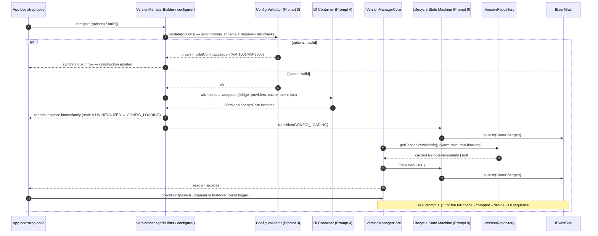

# Version Manager — Public API Design

**Design Document Series:** Phase 1 — Foundation · Prompt 2/40
**Scope:** `@rs-native-kit/version-check` — public API surface exposed to consumers of the React Native library (iOS, Android, Web via `react-native-web`).
**Status:** API specification only. No implementation code is included or implied by this document.

> **Scope note carried over from Prompt 1:** this library targets React Native only. Web is reached by the same JS/TS public API running under `react-native-web`, not a separate SDK — so the "Web adapter" below is the same Hooks API plus a framework-agnostic facade usable without React, rather than a distinct Web package. Flutter and standalone native Swift/Kotlin adapters are out of scope for this repository.

---

## 0. Design Goals for the Public Surface

1. **One entry point, two import paths.** `@rs-native-kit/version-check` exposes the framework-agnostic core (`configure`, `getInstance`, manual triggers, state queries, events, exceptions). `@rs-native-kit/version-check/ui` (or `src/ui.tsx`) additionally exposes the Hooks adapter and pre-built UI components. Importing only the first path pulls in zero React-specific code (tree-shaking, per Prompt 1 §8).
2. **Option bags, never positional parameters.** Every public method that takes more than a trivial single value takes one options object, so new optional fields can be added in a minor release without a breaking signature change.
3. **Fail fast on config, degrade gracefully on network.** Invalid configuration throws synchronously during `configure()`. Network/store failures never throw out of `checkForUpdates()` under default settings — they resolve to an `ActionPlan` reflecting the configured fallback behavior and additionally emit an `error` event for observability.
4. **Singleton by default, instance-able for tests.** `VersionManager.getInstance()` is the idiomatic path for app code; `VersionManagerBuilder.build()` returns a standalone, non-global instance for unit tests and multi-instance scenarios (e.g., Storybook, testing harnesses).

---

## 1. Initialization API

### 1.1 Two equivalent entry styles

Both compile to the same underlying `configure()` call; the builder exists for discoverability/IDE autocomplete on complex configurations, the function form for concise call sites.

```typescript
// Fluent builder
class VersionManagerBuilder {
  static create(): VersionManagerBuilder;

  withLogging(options: LoggingOptions): this;
  withCache(options: CacheOptions): this;
  withFallback(options: FallbackOptions): this;
  withStoreLinks(options: StoreLinksOptions): this;
  withPolicy(options: PolicyOptions): this;
  withPlatformBridge(bridge: IPlatformBridge): this;   // advanced: DI override, used by tests / __tests__/mocks

  build(): IVersionManagerCore;                          // synchronous construction; async readiness via .ready()
}

// Direct option-bag form
namespace VersionManager {
  function configure(options: VersionManagerOptions): IVersionManagerCore;
  function getInstance(): IVersionManagerCore;             // throws NotInitializedException if configure() was never called
  function isConfigured(): boolean;
  function reset(): void;                                    // testing/HMR only — tears down the singleton
}
```

### 1.2 Option bag schema (extensible — every field optional except where noted)

```typescript
interface VersionManagerOptions {
  /** Overrides auto-detected current app version. Primarily for testing/staging builds. */
  appVersion?: string;
  logging?: LoggingOptions;
  cache?: CacheOptions;
  fallback?: FallbackOptions;
  stores: StoreLinksOptions;                          // required — at least one store must be configured
  policy?: PolicyOptions;
  platformBridge?: IPlatformBridge;                     // DI override, advanced/testing use only
}

interface LoggingOptions {
  level?: LogLevel;                                    // default: 'warn'
  sink?: ILogSink;                                      // custom log destination; default: console-backed sink
}
type LogLevel = 'silent' | 'error' | 'warn' | 'info' | 'debug' | 'verbose';

interface CacheOptions {
  ttlMs?: number;                                       // default: 21_600_000 (6h)
  storage?: 'memory' | 'persistent';                    // default: 'persistent'
  bustOnManualCheck?: boolean;                          // default: true — checkForUpdates() bypasses cache unless overridden per-call
}

interface FallbackOptions {
  onNetworkError?: 'useCache' | 'useDefaultConfig' | 'noAction';   // default: 'useCache'
  defaultConfig?: RemoteVersionInfo;                                // used when onNetworkError === 'useDefaultConfig' and no cache exists
  requestTimeoutMs?: number;                                          // default: 8_000
  retry?: RetryOptions;
}

interface RetryOptions {
  maxAttempts?: number;                                 // default: 3
  backoff?: 'fixed' | 'exponential-jitter';             // default: 'exponential-jitter'
  baseDelayMs?: number;                                 // default: 500
}

interface StoreLinksOptions {
  ios?: { appStoreId: string; region?: string };
  android?: { packageName: string };
  huawei?: { appId: string };
  amazon?: { asin: string };
  custom?: { url: string; headers?: Record<string, string> };
}

interface PolicyOptions {
  forceUpdateBelow?: string;                            // SemVer string; versions strictly below this trigger FORCE_UPDATE_PROMPT
  reminderIntervalMs?: number;                          // default: 259_200_000 (3 days) — see Prompt 24
  rolloutPercentage?: number;                            // 0-100, default: 100 — see Prompt 18
}
```

### 1.3 Asynchronous readiness

`configure()`/`build()` return synchronously so the returned handle can be captured immediately at app bootstrap, but config validation against a remote source (Prompt 3) and cache warm-up are asynchronous. Consumers that must not call manual triggers before the SDK is ready await `.ready()`:

```typescript
interface IVersionManagerCore {
  ready(): Promise<void>;                                // resolves once state leaves CONFIG_LOADING (Prompt 9)
  // ...remaining members defined in §2-4
}
```

Calling a manual trigger before `ready()` resolves is **not** an error — it is queued and executed once initialization completes (see §6.2 lifecycle diagram), except in `strictReadiness` mode (opt-in via `VersionManagerOptions.strictReadiness = true`) where it instead throws `NotReadyException` immediately.

---

## 2. Manual Trigger APIs

```typescript
interface IVersionManagerCore {
  checkForUpdates(options?: CheckForUpdatesOptions): Promise<ActionPlan>;
  forceTriggerUpdate(options?: ForceTriggerOptions): Promise<void>;
  resetIgnoredVersions(options?: ResetIgnoredVersionsOptions): Promise<void>;
}

interface CheckForUpdatesOptions {
  bypassCache?: boolean;                                // default: follows CacheOptions.bustOnManualCheck
  silent?: boolean;                                      // default: false — if true, suppresses auto-presentation even when the UI layer is attached
  timeoutMs?: number;                                    // overrides FallbackOptions.requestTimeoutMs for this call only
  context?: Record<string, unknown>;                     // opaque metadata forwarded into policy evaluation (Prompt 6) and audit log (Prompt 30)
}

interface ForceTriggerOptions {
  reason?: string;                                       // audit metadata only — does not change SDK behavior
}

interface ResetIgnoredVersionsOptions {
  versions?: string[];                                    // reset specific versions only; omit to clear all ignored versions
}
```

`checkForUpdates()` never throws for network/store failures under default `FallbackOptions` — see §5.1 for the exact set of conditions under which it *does* reject its promise (config-level, not transient, errors).

---

## 3. State Query APIs

Synchronous, non-blocking, served from the last computed in-memory state — never trigger I/O. Safe to call at any point after `configure()`, including before `ready()` resolves (values are `null`/defaults until the first successful check).

```typescript
interface IVersionManagerCore {
  getCurrentState(): LifecycleState;
  getUpdateInfo(): UpdateInfo | null;
  isUpdateAvailable(): boolean;
  getActionPlan(): ActionPlan | null;
  getLastCheckedAt(): number | null;                      // epoch ms, null if never checked
}
```

All returned objects are frozen/`Readonly<T>` snapshots (§9.2) — mutating a returned `UpdateInfo` has no effect on SDK state.

---

## 4. Event Subscription & Listeners

### 4.1 Typed event map

```typescript
type VersionManagerEventMap = {
  stateChanged: StateChangedEvent;
  updateDetected: UpdateDetectedEvent;
  updateNotAvailable: UpdateNotAvailableEvent;
  userAction: UserActionEvent;
  error: VersionManagerErrorEvent;
};

interface StateChangedEvent {
  from: LifecycleState;
  to: LifecycleState;
  timestamp: number;
}

interface UpdateDetectedEvent {
  updateInfo: UpdateInfo;
  actionPlan: ActionPlan;
  timestamp: number;
}

interface UpdateNotAvailableEvent {
  currentVersion: string;
  checkedAt: number;
}

interface UserActionEvent {
  action: 'update_clicked' | 'later_clicked' | 'ignore_clicked' | 'dismiss_clicked';
  updateInfo: UpdateInfo;
  timestamp: number;
}

interface VersionManagerErrorEvent {
  error: VersionManagerException;
  phase: 'config' | 'check' | 'policy' | 'presentation';
  timestamp: number;
}
```

### 4.2 Subscription surface

Generic typed `on`/`off`/`once`, plus named convenience methods matching the most common lifecycle hooks — both operate on the same underlying dispatch, so mixing styles is safe.

```typescript
interface IVersionManagerEvents {
  on<K extends keyof VersionManagerEventMap>(
    event: K,
    handler: (payload: VersionManagerEventMap[K]) => void
  ): Unsubscribe;

  once<K extends keyof VersionManagerEventMap>(
    event: K,
    handler: (payload: VersionManagerEventMap[K]) => void
  ): Unsubscribe;

  off<K extends keyof VersionManagerEventMap>(
    event: K,
    handler: (payload: VersionManagerEventMap[K]) => void
  ): void;

  // Named convenience aliases
  onUpdateDetected(handler: (e: UpdateDetectedEvent) => void): Unsubscribe;
  onUserAction(handler: (e: UserActionEvent) => void): Unsubscribe;
  onError(handler: (e: VersionManagerErrorEvent) => void): Unsubscribe;
  onStateChanged(handler: (e: StateChangedEvent) => void): Unsubscribe;
}

interface IVersionManagerCore extends IVersionManagerEvents {
  // §1-3 members
}

type Unsubscribe = () => void;
```

`Unsubscribe` return values compose directly with React's `useEffect` cleanup and are idempotent (calling twice is a no-op, never throws).

---

## 5. Error Types & Exceptions

### 5.1 Exception hierarchy

```typescript
abstract class VersionManagerException extends Error {
  abstract readonly code: VersionManagerErrorCode;
  readonly cause?: unknown;
  readonly metadata?: Record<string, unknown>;
  readonly retryable: boolean;
  readonly timestamp: number;
}

class InvalidConfigException extends VersionManagerException {}
class NotInitializedException extends VersionManagerException {}
class NotReadyException extends VersionManagerException {}

abstract class NetworkException extends VersionManagerException {}
class RequestTimeoutException extends NetworkException {}
class RateLimitException extends NetworkException {}          // HTTP 429
class OfflineException extends NetworkException {}
class TlsHandshakeException extends NetworkException {}

abstract class StoreProviderException extends VersionManagerException {}
class AppNotFoundException extends StoreProviderException {}   // HTTP 404
class StorePermissionException extends StoreProviderException {}
class UnsupportedStoreException extends StoreProviderException {}
class StoreResponseParseException extends StoreProviderException {}

class InvalidVersionFormatException extends VersionManagerException {}
class PolicyEvaluationException extends VersionManagerException {}

abstract class CacheException extends VersionManagerException {}
class CacheCorruptionException extends CacheException {}
class CacheWriteException extends CacheException {}

class PlatformBridgeException extends VersionManagerException {}
class UnknownVersionManagerException extends VersionManagerException {}
```

### 5.2 Complete Error Code Registry

| Code | Class | Category | Retryable | Typical trigger | Thrown by / surfaced via |
|---|---|---|---|---|---|
| `VM-1001` | `InvalidConfigException` | Config | No | Missing required `stores`, malformed store IDs, schema validation failure (Prompt 3) | `configure()` — synchronous throw |
| `VM-1002` | `NotInitializedException` | Config | No | `getInstance()` called before any `configure()` | `getInstance()` — synchronous throw |
| `VM-1003` | `NotReadyException` | Config | No | Manual trigger called pre-`ready()` while `strictReadiness: true` | `checkForUpdates()`/`forceTriggerUpdate()` |
| `VM-2001` | `RequestTimeoutException` | Network | Yes | Store/API request exceeds `requestTimeoutMs` | `error` event; never rejects `checkForUpdates()` |
| `VM-2002` | `RateLimitException` | Network | Yes (backoff) | HTTP 429 from store provider | `error` event |
| `VM-2003` | `OfflineException` | Network | Yes | Device reports no connectivity at request time | `error` event |
| `VM-2004` | `TlsHandshakeException` | Network | No | Certificate/SSL pinning failure (Prompt 32) | `error` event |
| `VM-3001` | `AppNotFoundException` | Store Provider | No | HTTP 404 — bundle ID / package name not found on store | `error` event |
| `VM-3002` | `StorePermissionException` | Store Provider | No | Store API rejects credentials/App ID (Huawei/Amazon/Custom) | `error` event |
| `VM-3003` | `UnsupportedStoreException` | Store Provider | No | `StoreLinksOptions` references a store with no registered provider (tree-shaken out, Prompt 1 §8) | `configure()` — synchronous throw |
| `VM-3004` | `StoreResponseParseException` | Store Provider | No | Store payload does not match expected schema | `error` event |
| `VM-4001` | `InvalidVersionFormatException` | Version Parsing | No | SemVer engine (Prompt 5) cannot parse local or remote version string | `error` event; check resolves with `NO_ACTION` |
| `VM-5001` | `PolicyEvaluationException` | Policy | No | Rule/Decision engine (Prompts 6-7) receives an inconsistent evaluation context | `error` event |
| `VM-6001` | `CacheCorruptionException` | Cache | No (auto-recovers by cache wipe) | Persisted cache entry fails checksum (Prompt 8) | `error` event; treated as cache miss |
| `VM-6002` | `CacheWriteException` | Cache | Yes | Native storage write fails (disk full, permission) | `error` event |
| `VM-7001` | `PlatformBridgeException` | Platform Bridge | Depends on `metadata.underlyingCode` | Native module (`ios/`, `android/`) throws/rejects unexpectedly | `error` event |
| `VM-9999` | `UnknownVersionManagerException` | Internal | No | Any unhandled exception caught at the public-API boundary | `error` event — always logged at `error` level regardless of configured `LogLevel` |

**Contract:** codes `VM-1xxx` (config) are the *only* category that may reject a public-API promise or throw synchronously; every other category is reported exclusively via the `error` event and reflected in `ActionPlan`/fallback behavior, per §0 goal 3.

---

## 6. Framework Adapter: React Native Hooks (+ Web via `react-native-web`)

Exposed from the separate `@rs-native-kit/version-check/ui` entry point (Prompt 1 §8) — importing only the core path never pulls this in.

```typescript
// Hook: bootstraps (or attaches to) the singleton and returns the imperative handle + reactive state in one call.
function useVersionManager(options?: VersionManagerOptions): {
  manager: IVersionManagerCore;
  state: LifecycleState;
  updateInfo: UpdateInfo | null;
  isUpdateAvailable: boolean;
  checkForUpdates: (opts?: CheckForUpdatesOptions) => Promise<ActionPlan>;
};

// Hook: reactive state only, for components that don't need to trigger checks.
// Must be used beneath a component tree where useVersionManager() (or VersionManagerProvider) has run at least once.
function useUpdateState(): {
  state: LifecycleState;
  updateInfo: UpdateInfo | null;
  isUpdateAvailable: boolean;
  actionPlan: ActionPlan | null;
};

// Optional context provider for apps that prefer top-level configuration over per-hook options.
interface VersionManagerProviderProps {
  options: VersionManagerOptions;
  children: React.ReactNode;
}
function VersionManagerProvider(props: VersionManagerProviderProps): React.ReactElement;
```

**Web note:** because this is the same package running under `react-native-web`, `useVersionManager`/`useUpdateState`/`VersionManagerProvider` work unchanged on the Web target — `Platform.OS === 'web'` selects `WebPlatformBridge` internally (Prompt 1 §4.1). For non-React web embeds (e.g., a vanilla-JS widget host), the **core** entry point (`VersionManager.configure()` / `getInstance()`, §1) is already framework-agnostic plain TypeScript and requires no adapter:

```typescript
// Vanilla usage — no React import anywhere in this call path.
const manager = VersionManager.configure({ stores: { ... } });
manager.onUpdateDetected((e) => { /* render with any DOM/UI approach */ });
await manager.checkForUpdates();
```

No Flutter, standalone Swift, or standalone Kotlin adapter is defined — this library does not target those runtimes (Prompt 1, scope note).

---

## 7. SDK Initialization Lifecycle — Sequence Diagram



**Failure path during warm start:** if reading the persistent cache fails (`CacheCorruptionException`, `VM-6001`), the SDK does not fail initialization — it logs/emits `error`, treats it as an empty cache, and still transitions to `IDLE`. Initialization only ever hard-fails on `VM-1xxx` config codes, which reject before an instance is ever returned.

---

## 8. Integration Code Snippets (signatures only — no logic)

```typescript
// 1) App bootstrap — configure once, typically in the app's root entry file.
import { VersionManager } from '@rs-native-kit/version-check';

const manager: IVersionManagerCore = VersionManager.configure({
  stores: {
    ios: { appStoreId: '' },
    android: { packageName: '' },
  },
  cache: { ttlMs: 0 },
  policy: { forceUpdateBelow: '' },
});

// 2) Manual trigger + state query, anywhere after configure().
await manager.checkForUpdates({ bypassCache: true });
const info: UpdateInfo | null = manager.getUpdateInfo();

// 3) Event subscription with cleanup.
const unsubscribe: Unsubscribe = manager.onUpdateDetected((e: UpdateDetectedEvent) => {});
unsubscribe();

// 4) Error handling — only VM-1xxx reject/throw; everything else arrives via onError.
try {
  VersionManager.configure({ stores: {} as StoreLinksOptions });
} catch (e) {
  if (e instanceof InvalidConfigException) {}
}
manager.onError((e: VersionManagerErrorEvent) => {});

// 5) React Native / Web (react-native-web) Hooks usage.
import { useVersionManager, useUpdateState } from '@rs-native-kit/version-check/ui';

function RootComponent(): React.ReactElement {
  const { checkForUpdates, isUpdateAvailable } = useVersionManager({ stores: { /* ... */ } });
  return null as unknown as React.ReactElement;
}

function BadgeComponent(): React.ReactElement {
  const { isUpdateAvailable } = useUpdateState();
  return null as unknown as React.ReactElement;
}
```

---

## 9. Thread-Safety and Mutability Analysis

### 9.1 Where multi-threading actually exists in this library

React Native's JS runtime is single-threaded, so the **public TypeScript API surface** (everything in §1–§6) is inherently free of data races at the call level — there is never more than one JS call frame mutating SDK state at once. The genuine multi-threading in this codebase is confined to the **native module implementations** (`ios/PlatformBridge/IOSPlatformBridge.swift`, `android/.../platformbridge/AndroidPlatformBridge.kt`) required by Prompt 1 §4: Swift/Kotlin code invoked by the TurboModule bridge can run on arbitrary GCD queues / coroutine dispatchers, and OS-scheduled background work (`BGTaskScheduler`, `WorkManager`) can invoke bridge methods independent of any JS call.

### 9.2 Concurrency and mutability matrix

| Surface | Thread guarantee | Concurrency hazard | Mitigation |
|---|---|---|---|
| `VersionManager.configure()` / `getInstance()` | JS thread only | Two concurrent `configure()` calls in the same tick (e.g., duplicate provider mounts) | Idempotency guard: second `configure()` before `reset()` throws `InvalidConfigException` unless options are byte-identical, in which case it returns the existing instance |
| `checkForUpdates()` | JS thread only | Caller invokes a second `checkForUpdates()` while the first is still in flight | In-flight request coalescing: concurrent calls within one JS-thread execution share the same pending Promise rather than issuing duplicate network requests |
| `getCurrentState()` / `getUpdateInfo()` / `isUpdateAvailable()` | JS thread only | None — synchronous read of an immutable snapshot | Returned objects are `Readonly<T>` and structurally frozen (`Object.freeze` at the boundary where the snapshot is produced); mutating a returned value cannot affect internal state |
| Event handlers (`on`/`onX`) | Invoked on JS thread, in subscription order | A handler unsubscribes itself or another handler mid-dispatch | Event bus iterates over a copy-on-write snapshot of listeners (Prompt 1 §9.2) — safe to add/remove during dispatch |
| `IOSPlatformBridge` (Swift) | **Not** guaranteed single-threaded — TurboModule + `BGTaskScheduler` may invoke from multiple GCD queues | Concurrent reads/writes to Keychain-backed cache or in-flight `URLSession` task bookkeeping | Bridge internals isolated behind Swift `actor` (or a serial `DispatchQueue` for pre-concurrency targets); all state mutation funnels through the actor's isolated context before a result crosses back to JS |
| `AndroidPlatformBridge` (Kotlin) | **Not** guaranteed single-threaded — TurboModule + `WorkManager` may invoke from multiple coroutine dispatchers | Concurrent access to `EncryptedSharedPreferences`-backed cache, overlapping HTTP calls | Bridge internals confined to a single-thread `CoroutineDispatcher` guarded by `Mutex`; all public bridge methods are `suspend fun` that acquire the mutex before touching shared state |
| Promise/callback crossing the JS↔Native boundary | TurboModule infra marshals native completion back onto the JS thread | None additional — this is guaranteed by RN's bridge/JSI, not by this library | N/A — relied upon as a platform guarantee |

### 9.3 Mutability rules

- Every type returned from a **query** method (§3) or carried in an **event payload** (§4) is immutable from the consumer's perspective: TypeScript `Readonly<T>` at the type level, `Object.freeze` at the runtime level for objects crossing the public boundary.
- The only mutable, stateful object in the public surface is the `IVersionManagerCore` instance itself, and it exposes no public field mutation — all state changes happen through the defined methods, each of which is internally serialized (§9.2) even though JS's single-threaded model makes that serialization mostly about async-ordering correctness rather than true data-race prevention.
- `VersionManagerOptions` passed to `configure()` is **read once** at initialization and defensively copied; retaining a reference to the original options object and mutating it after `configure()` returns has no effect on the running instance.

---

## 10. Cross-References

- Config schema and validation rules referenced in §1.2/§5.2/§7 → Prompt 3.
- DI container wiring referenced in §7 → Prompt 4.
- SemVer parsing errors (`VM-4001`) → Prompt 5. Policy/decision errors (`VM-5001`) → Prompts 6-7. Lifecycle states referenced throughout → Prompt 9.
- Store provider exceptions (`VM-3xxx`) map 1:1 to the provider specs in Prompts 10-14.
- `UserActionEvent` values (`later_clicked`, `ignore_clicked`) are defined in full in Prompt 24 (Ignore & Remind Me Later).
- Audit log consumption of every event in §4 → Prompt 30.