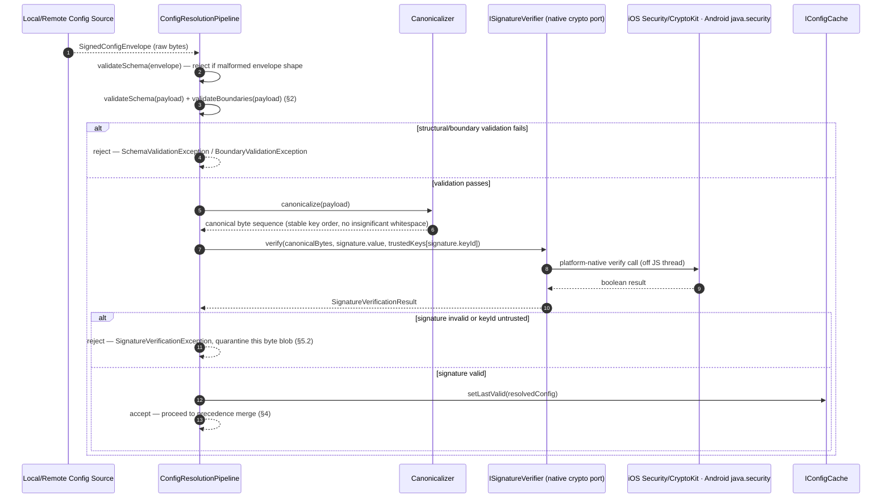
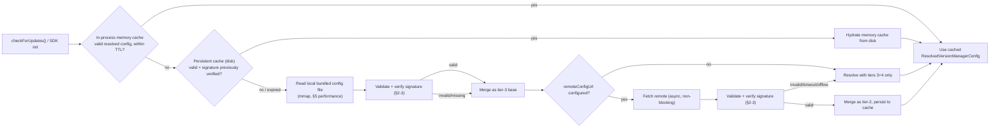
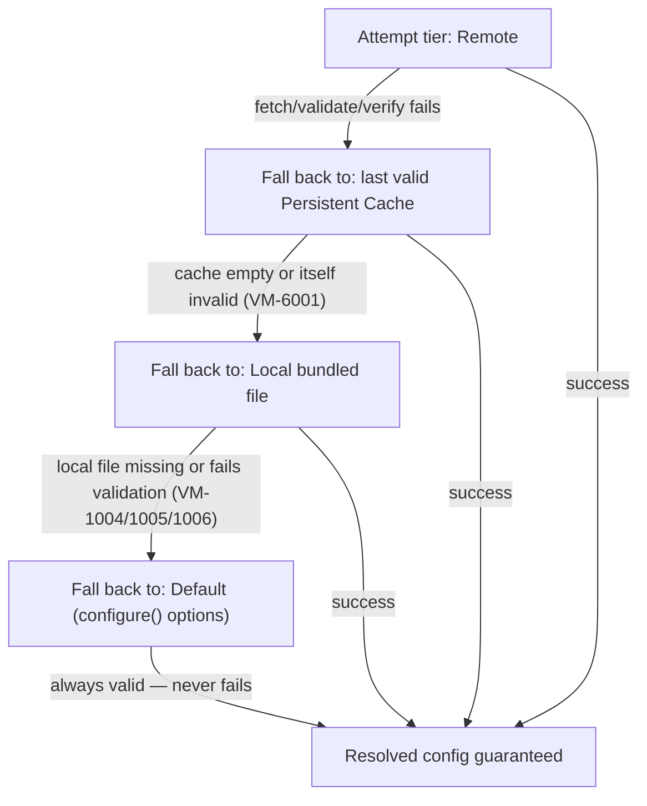

# Version Manager — Configuration System

**Design Document Series:** Phase 1 — Foundation · Prompt 3/40
**Scope:** `@rs-native-kit/version-check` — configuration loading, validation, precedence, and tamper protection for the React Native library (iOS, Android, Web via `react-native-web`).
**Status:** Design specification only. No implementation code is included or implied by this document.

> **Scope note (carried over from Prompts 1-2):** single React Native package; no Flutter/standalone Swift/Kotlin config loaders. "Environment variables" is reinterpreted for mobile reality in §4 — there is no OS process environment on a device, so that tier maps to build-time-injected constants and explicit runtime overrides, not `process.env` on a server.

---

## 0. Relationship to the Public API (Prompt 2)

Prompt 2 defined `VersionManagerOptions` as the object passed to `VersionManager.configure(options)`. This document defines a **richer, loadable configuration document** — the `VersionManagerConfigDocument` — that can additionally come from a bundled local JSON asset and/or a remote URL, and that can hot-update the running instance after a successful fetch. The two are reconciled as one precedence chain:

> The `VersionManagerOptions` object a developer hardcodes at `configure()` **is** the "Default fallback config" tier referenced throughout this document. Local file, remote URL, and environment overrides are all optional and layer on top of it, field by field. An app that never ships a local config file or remote URL still works correctly, driven entirely by `configure()` options — this document adds optionality, not a new requirement.

`IConfigProvider` (stubbed in Prompt 1 §7) is expanded here into a small pipeline of ports, all living under `src/data/config/`:

```typescript
interface IConfigProvider {
  load(request: ConfigLoadRequest): Promise<ResolvedVersionManagerConfig>;
  subscribe(listener: (config: ResolvedVersionManagerConfig) => void): Unsubscribe;   // fires on remote hot-update
}

interface ILocalConfigSource {
  read(): Promise<RawConfigDocument | null>;                 // null if no bundled config asset exists
}

interface IRemoteConfigSource {
  fetch(url: string, options: FetchOptions): Promise<RawConfigDocument>;
}

interface IEnvironmentOverrideSource {
  read(): Promise<Partial<VersionManagerConfigDocument>>;      // build-time constants + explicit runtime overrides
}

interface IConfigCache {
  getLastValid(): Promise<ResolvedVersionManagerConfig | null>;
  setLastValid(config: ResolvedVersionManagerConfig): Promise<void>;
}

interface IConfigValidator {
  validateSchema(doc: RawConfigDocument): SchemaValidationResult;
  validateBoundaries(doc: RawConfigDocument): BoundaryValidationResult;
}

interface ISignatureVerifier {
  verify(envelope: SignedConfigEnvelope, trustedKeys: TrustedKeySet): Promise<SignatureVerificationResult>;
}
```

---

## 1. Properties Schema

### 1.1 Field groups

| Group | Field | Type | Source tiers it may appear in | Notes |
|---|---|---|---|---|
| Identity | `localVersionIdentifier` | `string?` (SemVer) | default, env | Overrides auto-detected `appInfo.getCurrentVersion()` (Prompt 1 §4); mirrors `VersionManagerOptions.appVersion` from Prompt 2 |
| Remote source | `remoteConfigUrl` | `string?` (HTTPS URL) | default, env | If absent, the SDK operates in local-file/default-only mode |
| Cache | `cache.ttlMs` | `integer >= 0` | default, local, remote, env | 0 means "always revalidate" |
| Cache | `cache.storage` | `'memory' \| 'persistent'` | default, local, remote | See Prompt 8 |
| Network | `network.requestTimeoutMs` | `integer > 0` | default, local, remote, env | |
| Network | `network.retry.maxAttempts` | `integer, 0-10` | default, local, remote, env | |
| Network | `network.retry.backoff` | `'fixed' \| 'exponential-jitter'` | default, local, remote | |
| Network | `network.retry.baseDelayMs` | `integer > 0` | default, local, remote | |
| Alerts | `alerts.forceUpdateBelow` | `string?` (SemVer) | default, local, remote, env | Prompt 6/15 |
| Alerts | `alerts.reminderDelayMs` | `integer >= 0` | default, local, remote, env | Prompt 24 |
| Alerts | `alerts.customUiHookIds` | `string[]` | default, local, remote | **Identifiers only** — see §1.2 |
| Stores | `stores.ios.appStoreId` | `string?` (numeric string) | default, local, remote | |
| Stores | `stores.android.packageName` | `string?` | default, local, remote | |
| Stores | `stores.huawei.appId` | `string?` | default, local, remote | |
| Stores | `stores.amazon.asin` | `string?` | default, local, remote | |
| Stores | `stores.custom.url` / `.headers` | `string? / Record<string,string>?` | default, local, remote | |
| Security | `security.signatureAlgorithm` | `'ed25519' \| 'hmac-sha256' \| 'none'` | default | Fixed by the app developer; not overridable by remote/env (§3) |
| Security | `security.trustedKeyIds` | `string[]` | default | |
| Meta | `schemaVersion` | `string` | all tiers | For migration, Prompt 40 |

### 1.2 Why UI hooks are identifiers, not functions

Local and remote config documents are **pure JSON** — functions cannot cross that boundary. `alerts.customUiHookIds` carries string identifiers (e.g., `"custom-force-update-screen"`); the actual callback/component is registered in code via `VersionManagerOptions` (Prompt 2) or a dedicated `registerUiHook(id, handler)` call. The config document only decides *which registered hook is active*, never *what the hook does*.

---

## 2. Validation Rules

Validation runs as a strict pipeline: **schema → boundaries → signature** (§3). A document must pass all three stages to be accepted; failing any stage triggers the fallback cascade in §5.

### 2.1 Schema validation (structural)

Performed by a hand-rolled, zero-dependency validator (consistent with Prompt 1 §9.3 — no `ajv`, no third-party JSON Schema library) that walks the config against the schema in §6: required-field presence, type checks, enum membership, and `additionalProperties: false` at every level (unknown fields are rejected, not silently ignored, to catch typos and downgrade attacks that smuggle unexpected keys).

### 2.2 Boundary validation (semantic)

| Rule | Check |
|---|---|
| Timeouts positive | `network.requestTimeoutMs > 0`, `network.retry.baseDelayMs > 0` |
| TTL non-negative | `cache.ttlMs >= 0` |
| Retry bounds | `0 <= network.retry.maxAttempts <= 10` |
| SemVer validity | `localVersionIdentifier` and `alerts.forceUpdateBelow`, when present, must parse successfully through the SemVer engine (Prompt 5) — reuse the same parser, not a separate regex |
| URL scheme | `remoteConfigUrl` and `stores.custom.url` must be `https://` (plain `http://` rejected outside an explicit `allowInsecureUrls` dev-only flag) |
| Store ID shape | `stores.ios.appStoreId` numeric-string pattern; `stores.android.packageName` matches Java package-name grammar; `stores.amazon.asin` matches `^[A-Z0-9]{10}$`; `stores.huawei.appId` matches Huawei AppGallery's numeric ID grammar |
| Document size | Serialized document ≤ 64 KB (bounds parse/verify time and memory footprint, Prompt 1 §9.1) |

### 2.3 Cryptographic validation

See §3 — a separate, dedicated stage, because it must run **after** structural/boundary validation succeeds (no point verifying a signature over a document that's already structurally invalid) but **before** the document's values are trusted and merged.

---

## 3. Cryptographic Signature Verification Protocol

### 3.1 Envelope format

Every local and remote config document is wrapped in a signed envelope. The `payload` is the actual `VersionManagerConfigDocument` (§6); everything outside `payload` is verification metadata.

```json
{
  "schemaVersion": "1.0",
  "payload": { "...": "VersionManagerConfigDocument fields, §6" },
  "signature": {
    "algorithm": "ed25519",
    "keyId": "vm-2026-primary",
    "value": "base64-encoded-signature",
    "signedAt": "2026-07-21T00:00:00Z"
  }
}
```

- `algorithm: "none"` is permitted only for the **local bundled** document in development builds (`__DEV__`); it is rejected for any remote fetch and for local documents in release builds, enforced by the validator regardless of what `security.signatureAlgorithm` claims (a compromised/tampered document cannot downgrade its own algorithm to `none` and be believed).
- `ed25519` is the recommended asymmetric algorithm (publish the private key only in CI signing infrastructure, ship only the public key with the app). `hmac-sha256` is offered for teams without PKI tooling, at the cost of the shared secret being embedded in the app binary — documented as a known limitation, not a security boundary (§3.4).

### 3.2 Verification sequence



### 3.3 Canonicalization

Signatures are computed over a canonical byte form, not the raw JSON text (whitespace/key-order differences must not invalidate a legitimately signed document). The canonicalizer is a small, hand-rolled implementation of the same principles as RFC 8785 (JSON Canonicalization Scheme) — recursive key sorting (UTF-16 code unit order), fixed number formatting, no insignificant whitespace — kept in `src/data/config/canonicalize.ts`, zero external dependencies.

### 3.4 Key management and rotation

- Trusted public keys (or HMAC secrets) are embedded at **build time** via native platform mechanisms (iOS `Info.plist`/`Secrets.xcconfig`, Android `BuildConfig` field or `local.properties`-injected Gradle constant) — never hardcoded directly in the JS bundle, to keep them out of the most easily-inspected artifact, though client-side secrets are ultimately extractable from any compiled app. **This protocol defends against config *tampering in transit/at rest* (a compromised CDN edge, a modified bundled asset, a MITM'd remote fetch) — it is not a substitute for server-side authorization.** True anti-tampering against a hostile end user is Prompt 32's concern (root/jailbreak detection, NTP clock checks).
- `security.trustedKeyIds` allows more than one currently-valid key (`["vm-2026-primary", "vm-2026-next"]`) so keys can rotate with an overlap window: the signer switches to the new key, old-key-signed cached documents remain valid until their TTL naturally expires, and the old key is removed from the trusted set only after the rotation window closes.
- Signature verification calls (`ISignatureVerifier`) are implemented using **OS-provided cryptography** exclusively — iOS `CryptoKit`/`Security.framework`, Android `java.security.Signature` (Ed25519 via `EdDSA`/`Ed25519` provider) and `javax.crypto.Mac` (HMAC-SHA256). These are platform APIs, not third-party packages, so they do not violate the zero-external-dependency constraint (Prompt 1 §9.3).

---

## 4. Multi-Environment Loading Lifecycle

### 4.1 Two distinct concerns

1. **Precedence resolution** — for a given field, which source's value wins.
2. **Access path** — where bytes physically come from, ordered to minimize I/O and latency, independent of precedence.

These are often confused; this document keeps them as separate matrices.

### 4.2 Precedence Resolution Matrix

Highest precedence first. Resolution is **per-field deep merge**, not whole-document replacement — a field absent at a higher tier falls through to the next tier rather than nulling out a lower tier's value.

| Precedence | Tier | Typical origin | Can this tier be absent? | Overrides |
|---|---|---|---|---|
| 1 (highest) | Environment overrides | Build-time constants (`Info.plist`/`BuildConfig`) + explicit `configure({ envOverrides })` call | Yes — most apps ship none | Everything below, per field present |
| 2 | Remote configuration | `remoteConfigUrl` fetch result, signature-verified | Yes — if `remoteConfigUrl` unset or fetch fails, falls through | Local file, default |
| 3 | Local configuration file | Bundled JSON asset, signature-verified (or `none` in `__DEV__`) | Yes — no bundled file is valid | Default |
| 4 (lowest) | Default fallback config | The `VersionManagerOptions` object passed to `configure()` (Prompt 2) | **No — always present**, this is the floor | Nothing; guarantees a always-valid resolved config |

**Worked example:** `network.requestTimeoutMs` is set to `8000` in `configure()` (tier 4), unset in the local file, set to `12000` in the last-fetched remote config, and unset in env overrides → resolved value is `12000`. `alerts.forceUpdateBelow` is set to `"2.0.0"` in `configure()` and overridden to `"2.1.0"` in env overrides (a QA build forcing a stricter test) → resolved value is `"2.1.0"` regardless of what remote/local say.

`security.signatureAlgorithm` and `security.trustedKeyIds` are the one exception: they are **only** ever read from tier 4 (`configure()`), never from local/remote/env — a config document cannot alter the rules used to verify config documents (§3.1).

### 4.3 Access Path (memory cache → persistent cache → local file → remote fetch)

This is the *performance* path, answering "where do we look first," not "who wins":



The memory cache is always consulted first (near-zero cost); the persistent cache backs it across app restarts (Prompt 8); the local file and remote fetch are the two tiers that actually require parsing/verification work, which is why §5's performance requirements target exactly those two.

### 4.4 Runtime hot-update

A successful remote fetch that produces a **different** resolved config than the currently active one publishes a config-change notification (`IConfigProvider.subscribe`) and the running `IVersionManagerCore` adopts the new resolved values for subsequent operations — it does not require an app restart. In-flight operations (e.g., a `checkForUpdates()` already awaiting a store response) complete against the config snapshot they started with; only the *next* operation observes the update. This mirrors the copy-on-write/immutable-snapshot discipline established in Prompt 2 §9.

---

## 5. Performance

### 5.1 Memory-mapped parsing for local configs

The bundled local config asset is read through a memory-mapped file handle rather than a full buffered read, avoiding a double copy (OS page cache → native heap buffer → JS heap string) for a file that may be re-read across app cold starts:

- **iOS:** `Data(contentsOf:options:.alwaysMapped)` inside `IOSPlatformBridge`'s storage adapter, backing a small `LocalConfigFileReader` used only by the config pipeline.
- **Android:** `FileChannel.map(FileChannel.MapMode.READ_ONLY, ...)` producing a `MappedByteBuffer`, decoded to UTF-8 only for the bytes actually consumed.
- **Web:** no OS-level mmap primitive exists in the browser; the equivalent optimization is fetching the bundled config as a static asset with `Cache-Control: immutable` so the browser's own disk cache serves it without a network round-trip on repeat loads. This is documented as the Web-target equivalent, not a gap.

Because the local config document is capped at 64 KB (§2.2), the *absolute* savings from mmap are modest — the requirement is satisfied primarily to avoid unnecessary allocation churn against the 5 MB runtime budget (Prompt 1 §9.1) on low-end Android devices where repeated GC pressure from buffer copies is measurable, not because the file is large.

### 5.2 Non-blocking asynchronous I/O during validation

- File reads, network fetches, and native crypto `verify()` calls are all `async`/`Promise`-based and execute on the native module thread pool (Prompt 1 §10), never blocking the JS thread.
- Structural/boundary validation (§2.1-2.2) operates on an already-in-memory ≤64 KB string and completes in low-single-digit milliseconds — it does not need to be chunked, but it is still invoked from within the same async chain as the I/O that produced its input, so it never introduces a synchronous blocking window on the JS thread even though the work itself is CPU-bound and technically synchronous.
- The full pipeline (§4.3 flow) never blocks `IVersionManagerCore`'s public API: `checkForUpdates()` awaits config resolution as one step in its existing async use case (Prompt 1 §6), with no additional synchronous phase introduced.

---

## 6. Complete JSON Schema Definition

```json
{
  "$schema": "https://json-schema.org/draft/2020-12/schema",
  "$id": "https://schemas.rs-native-kit.dev/version-check/config-envelope.json",
  "title": "VersionManagerSignedConfigEnvelope",
  "type": "object",
  "additionalProperties": false,
  "required": ["schemaVersion", "payload", "signature"],
  "properties": {
    "schemaVersion": { "type": "string", "pattern": "^\\d+\\.\\d+$" },
    "payload": { "$ref": "#/$defs/VersionManagerConfigDocument" },
    "signature": {
      "type": "object",
      "additionalProperties": false,
      "required": ["algorithm", "keyId", "value", "signedAt"],
      "properties": {
        "algorithm": { "type": "string", "enum": ["ed25519", "hmac-sha256", "none"] },
        "keyId": { "type": "string", "minLength": 1 },
        "value": { "type": "string", "contentEncoding": "base64" },
        "signedAt": { "type": "string", "format": "date-time" }
      }
    }
  },
  "$defs": {
    "VersionManagerConfigDocument": {
      "type": "object",
      "additionalProperties": false,
      "properties": {
        "localVersionIdentifier": { "type": "string", "pattern": "^\\d+\\.\\d+\\.\\d+(-[0-9A-Za-z.-]+)?(\\+[0-9A-Za-z.-]+)?$" },
        "remoteConfigUrl": { "type": "string", "format": "uri", "pattern": "^https://" },
        "cache": {
          "type": "object",
          "additionalProperties": false,
          "properties": {
            "ttlMs": { "type": "integer", "minimum": 0 },
            "storage": { "type": "string", "enum": ["memory", "persistent"] }
          }
        },
        "network": {
          "type": "object",
          "additionalProperties": false,
          "properties": {
            "requestTimeoutMs": { "type": "integer", "exclusiveMinimum": 0 },
            "retry": {
              "type": "object",
              "additionalProperties": false,
              "properties": {
                "maxAttempts": { "type": "integer", "minimum": 0, "maximum": 10 },
                "backoff": { "type": "string", "enum": ["fixed", "exponential-jitter"] },
                "baseDelayMs": { "type": "integer", "exclusiveMinimum": 0 }
              }
            }
          }
        },
        "alerts": {
          "type": "object",
          "additionalProperties": false,
          "properties": {
            "forceUpdateBelow": { "type": "string", "pattern": "^\\d+\\.\\d+\\.\\d+(-[0-9A-Za-z.-]+)?(\\+[0-9A-Za-z.-]+)?$" },
            "reminderDelayMs": { "type": "integer", "minimum": 0 },
            "customUiHookIds": { "type": "array", "items": { "type": "string", "minLength": 1 } }
          }
        },
        "stores": {
          "type": "object",
          "additionalProperties": false,
          "properties": {
            "ios": {
              "type": "object", "additionalProperties": false,
              "properties": { "appStoreId": { "type": "string", "pattern": "^[0-9]{6,12}$" } }
            },
            "android": {
              "type": "object", "additionalProperties": false,
              "properties": { "packageName": { "type": "string", "pattern": "^[a-z][a-z0-9_]*(\\.[a-z][a-z0-9_]*)+$" } }
            },
            "huawei": {
              "type": "object", "additionalProperties": false,
              "properties": { "appId": { "type": "string", "pattern": "^[0-9]{6,12}$" } }
            },
            "amazon": {
              "type": "object", "additionalProperties": false,
              "properties": { "asin": { "type": "string", "pattern": "^[A-Z0-9]{10}$" } }
            },
            "custom": {
              "type": "object", "additionalProperties": false,
              "properties": {
                "url": { "type": "string", "format": "uri", "pattern": "^https://" },
                "headers": { "type": "object", "additionalProperties": { "type": "string" } }
              }
            }
          }
        },
        "security": {
          "type": "object",
          "additionalProperties": false,
          "properties": {
            "signatureAlgorithm": { "type": "string", "enum": ["ed25519", "hmac-sha256", "none"] },
            "trustedKeyIds": { "type": "array", "items": { "type": "string" }, "minItems": 1 }
          }
        },
        "schemaVersion": { "type": "string", "pattern": "^\\d+\\.\\d+$" }
      }
    }
  }
}
```

Maximum serialized size of the full envelope: **64 KB** (§2.2), enforced before schema validation even begins (a cheap byte-length check that short-circuits pathological payloads).

---

## 7. Error Mitigation Strategy for Corrupt Configurations

### 7.1 New error codes (extends the registry in Prompt 2 §5.2, `VM-1xxx` config range)

| Code | Class | Retryable | Trigger |
|---|---|---|---|
| `VM-1004` | `SchemaValidationException` | No | Document fails §2.1 structural validation |
| `VM-1005` | `BoundaryValidationException` | No | Document passes schema but fails §2.2 semantic bounds |
| `VM-1006` | `SignatureVerificationException` | No | Signature missing, malformed, or cryptographically invalid (§3) |
| `VM-1007` | `ConfigSizeLimitExceededException` | No | Envelope exceeds 64 KB before parsing begins |
| `VM-1008` | `UntrustedKeyIdException` | No | `signature.keyId` not present in `security.trustedKeyIds` |
| `VM-1009` | `EnvironmentOverrideConflictException` | No | Env override references a `customUiHookIds` value with no registered handler |

All are non-retryable in the network sense (retrying the same bytes produces the same failure) but do **not** halt SDK initialization — per §7.2, each triggers a fallback, not a fatal error.

### 7.2 Cascading fallback



Guarantee: `Default fallback config` (tier 4, §4.2) is validated **once, at CI/build time** (Prompt 40's CI gate runs the same schema/boundary validator against every `configure()` call site in example/test code), so at runtime it is treated as always-valid and never itself subject to rejection — this is what makes the cascade terminate rather than risk an unconfigured SDK.

### 7.3 Partial vs. whole-document fallback

- **Field-level fallback (default):** if only some fields in an otherwise-valid, signature-verified document fail boundary validation (e.g., `network.retry.maxAttempts: 15`, out of range), only those specific fields fall through to the next tier; the rest of the document's valid fields are still applied. This keeps one malformed field in a remote config from disabling an otherwise-good update.
- **Whole-document fallback:** triggered when schema validation fails outright (the document doesn't parse into recognizable shape) or signature verification fails (§3.2) — a signature failure means the *entire* payload is untrusted, so no field from it may be used, even ones that look reasonable.

### 7.4 Quarantine and circuit breaking

- A specific byte-for-byte document that fails signature verification is fingerprinted (hash of raw bytes) and quarantined for the remainder of the session — it will not be re-validated or re-logged repeatedly if the same bad bytes are fetched again within a short window (e.g., a misconfigured CDN serving stale content).
- If remote config fetch+validation fails **N consecutive times** (default 5, configurable), the SDK stops attempting remote fetches for a cool-down window and relies on local file + default tiers only, per the circuit-breaker pattern detailed fully in Prompt 36. This prevents a persistently broken remote endpoint from adding latency/battery cost to every check.
- Every fallback transition (§7.2) and quarantine event emits `onError` (Prompt 2 §4) with the relevant `VM-1xxx` code and is recorded by the audit log (Prompt 30) with the tier that ultimately succeeded, so operators can see in telemetry how often each app instance is running on degraded (non-remote) configuration.

---

## 8. Cross-References

- SemVer parsing used by `localVersionIdentifier`/`forceUpdateBelow` validation → Prompt 5.
- `alerts.forceUpdateBelow`, `alerts.reminderDelayMs` consumption → Prompts 6, 15, 24.
- Persistent/memory cache backing §4.3 → Prompt 8.
- `VM-6001 CacheCorruptionException` referenced in §7.2 → Prompt 2 §5.2 / Prompt 8.
- Circuit breaker detail for §7.4 → Prompt 36.
- Build-time environment/flavor injection detail for §4.1 tier 1 → Prompt 34.
- Anti-tampering beyond config signing (root/jailbreak, NTP clock) → Prompt 32.
- CI-time validation of default config guarantee (§7.2) → Prompt 40.
